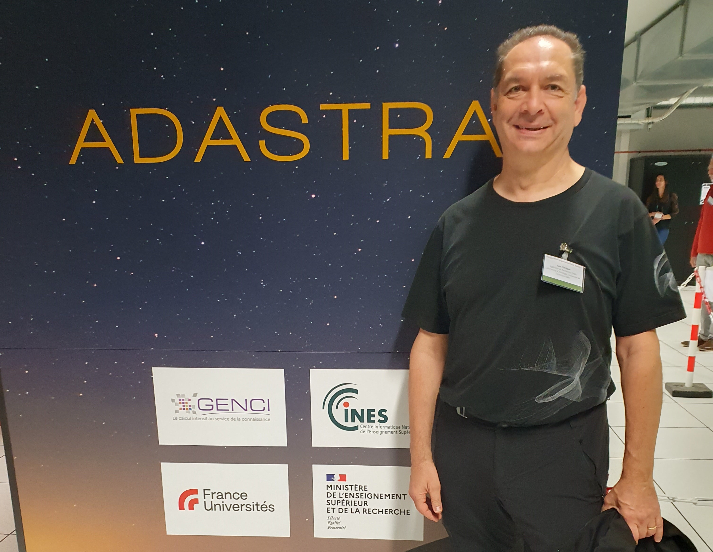

Infolettre #04
================================================

**10 janvier 2025.** Version française, English version `here <newsletter_03_english.html>`_.

Chers utilisateurs, chères utilisatrices de Méso-NH,

Nous vous souhaitons tout d'abord une très bonne année 2025 ! Riche en découverte grâce à vos futures simulations :)

Voici ci-dessous la 4ème infolettre de notre communauté. Vous y trouverez un entretien avec un développeur de Méso-NH, les dernières nouvelles de l’équipe support et la liste des dernières publications utilisant Méso-NH.

Entretien avec `Robert S <mailto:email@cnrs.fr>`_ (CNRM)
************************************************************************************

Juan, tu as porté Méso-NH 5-5-1 sur GPU avec Philippe. Pourrais-tu décrire de quoi il s'agit et les perspectives d'utilisation que cela ouvre ?
  rep

  rep suite

Quel intérêt y a-t-il à réaliser des simulations sur les calculateurs dotés de GPU plutôt que sur ceux basés sur des CPU uniquement ?
  rep [#flop1]_ rep [#flop2]_ de la puissance totale.

.. [#flop1] Pétaflops = millions de milliards d'opérations de calcul par seconde. 
.. [#flop2] 1 Exaflop = 1000 Pétaflops.

Y a-t-il des situations qui se prêtent particulièrement bien à l'utilisation de Méso-NH 5-5-1 sur GPU ?
  rep

  rep suite

Quelles recommandations ferais-tu aux utilisateur.trices qui souhaiteraient simuler sur GPU ?
  rep

  rep

Quelles sont les limites pour l'instant de ce portage de Méso-NH ? les perspectives ?
  rep

  rep

  rep

  rep

.. note::

   Si vous aussi vous souhaitez expliquer un développement que vous avez mis en place dans Méso-NH, ou une méthode d’analyse que vous partagez à la communauté, n’hésitez pas à me le signaler par `mail <mailto:thibaut.dauhut@univ-tlse3.fr>`_.

    
    
Les nouvelles de l’équipe support
************************************

Version 5.7.1 (sortie le 4 septembre)
  - Liste des bugfixs
  - Notez que tous les cas tests 

Version 5.8
  Un appel à contribution sera lancée en décembre. 

Développements en cours et récents
  - Chimie/aérosols
  - Version 6.0
  - Outils
  - Forge logicielle
  - Site vitrine
  - Couplage

Ménage des fichiers en sortie
  - les fichiers .des inutiles (car vides) ne seront plus écrits.
  - les fichiers de statistiques détaillées des performances du solveur de pression ne sont plus écrits.
  - le fichier file_for_xtransfer a également disparu (ainsi que quelques morceaux de code devenus inutiles).
  - le fichier OUTPUT_LISTING0 est conservé sauf s'il est vide 
Stage Méso-NH
  - Le prochain stage aura lieu du 12 au 15 novembre 2024. Planning `ici <http://mesonh.aero.obs-mip.fr/mesonh57/MesonhTutorial>`_
  - Date limite d'inscription : 1er novembre
  - Inscription par mail à `Quentin Rodier <mailto:quentin.rodier@meteo.fr>`_

.. note::
  Si vous avez des besoins, idées, améliorations à apporter, bugs à corriger ou suggestions concernant les entrées/sorties, `Philippe Wautelet <mailto:philippe.wautelet@cnrs.fr>`_ est preneur.

Dernières publications utilisant Méso-NH
****************************************************************************************

Fire meteorology
  - A case study of the possible meteorological causes of unexpected fire behavior in the Pantanal Wetland, Brazil [`Couto et al., 2024 <https://doi.org/10.3390/earth5030028>`_]
  - The Role of atmospheric circulation in favouring forest fires in the extreme southern Portugal [`Purificação et al., 2024 <https://doi.org/10.3390/su16166985>`_]

Microphysics
  - Improving supercooled liquid water representation in the microphysical scheme ICE3 [`Dupont et al., 2024 <http://dx.doi.org/10.1002/qj.4806>`_]
  - Importance of CCN activation for fog forecasting and its representation in the two-moment microphysical scheme LIMA [`Vié et al., 2024 <https://doi.org/10.1002/qj.4812>`_]

Model development
  - Porting the Meso-NH atmospheric model on different GPU architectures for the next generation of supercomputers (version MESONH-v55-OpenACC) [`Escobar et al., in discussion <https://doi.org/10.5194/egusphere-2024-2879>`_]

Radiation
  - How to observe the small-scale spatial distribution of surface solar irradiance [`He et al., in discussion <https://doi.org/10.5194/egusphere-2024-1064>`_]

Thermodynamics over complex terrain and in urban environment
  - Thermodynamic processes driving thermal circulations on slopes: Modeling anabatic and katabatic flows on Reunion Island [`El Gdachi et al., 2024 <https://doi.org/10.1029/2023JD040431>`_]
  - Energy and environmental impacts of air-to-air heat pumps in a mid-latitude city [`Meyer et al., 2024 <https://doi.org/10.1038/s41467-024-49836-3>`_]

.. note::

   Si vous souhaitez partager avec la communauté le fait qu’un de vos projets utilisant Méso-NH a été financé ou toute autre communication sur vos travaux (notamment posters et présentations *disponibles en ligne*), n’hésitez pas à m’écrire. A l’occasion de la mise en place de ces infolettres, je suis également preneur de vos avis sur le format proposé.

Bonnes simulations avec Méso-NH !

A bientôt,

Thibaut Dauhut et toute l’équipe Méso-NH : Philippe Wautelet, Quentin Rodier, Didier Ricard, Joris Pianezze, Juan Escobar et Jean-Pierre Chaboureau
