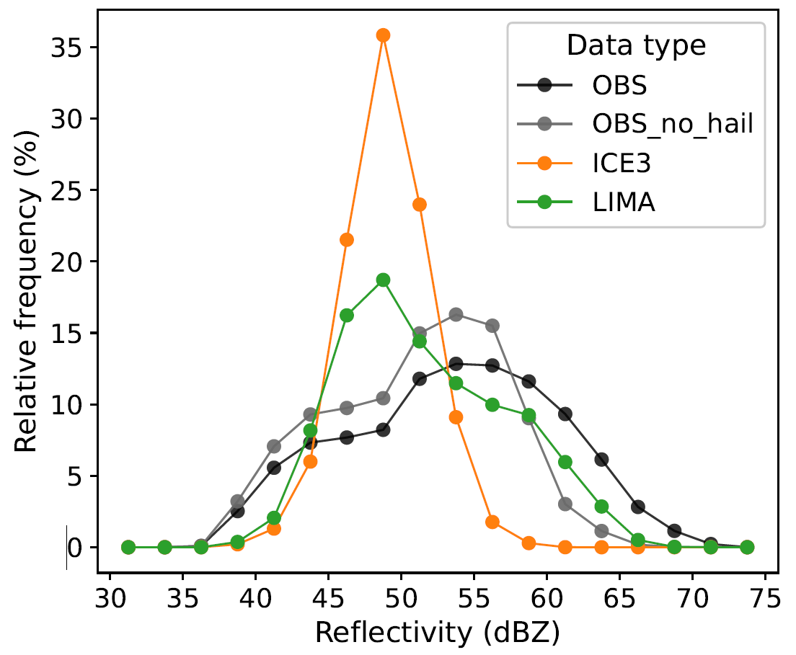

Infolettre #CA
================================================

**X xxxxx 2025.** Version française, English version `here <newsletter_03_english.html>`_.

Chers utilisateurs, chères utilisatrices de Méso-NH,

Voici ci-dessous la Xème infolettre de notre communauté. Vous y trouverez un entretien avec la développeuse d'un outil utile aux utilisateurs.trices de Méso-NH, les dernières nouvelles de l’équipe support et la liste des dernières publications utilisant Méso-NH.

Entretien avec `Clotilde Augros <mailto:clotilde.augros@meteo.fr>`_ (CNRM)
************************************************************************************

Clotilde, tu as développé un simulateur radar qui peut tourner à partir des sorties de Méso-NH. Pourrais-tu résumer ce que fait cet outil ?
  Ce code, appelé **operadar** (`Augros et al., 2016 <https://doi.org/10.1002/qj.2572>`_, `David et al. 2025 <https://doi.org/10.5194/egusphere-2025-685>`_) prend les variables du modèle en entrée (rapports de mélange et éventuellement concentrations en nombre des hydrométéores, température, altitude, pression) et calcule en chaque point de grille du modèle les variables radar (réflectivité Zh, réflectivité différentielle Zdr, phase différentielle spécifique Kdp, coefficient de corrélation :math:`\rho` hv) à partir de tables de coefficients de rétrodiffusion calculées en bande S, C, X (en cours de préparation : Ka, W). La méthode de diffusion utilisée est la méthode de la matrice T (`Waterman, 1965 <https://doi.org/10.1109/PROC.1965.4058>`_) qui représente les hydrométéores comme des sphéroïdes aplatis. Cet outil écrit en Python est conçu pour fonctionner *hors ligne*. Il est indépendant du code Méso-NH, et peut aussi bien être utilisé avec des sorties AROME par exemple. Les améliorations apportées pour l'utilisation avec un modèle bénéficient à tous les autres grâce au maintien et l'évolution collaborative du code sur le `dépôt git d'operadar <https://github.com/UMR-CNRM/operadar>`_.

Pourquoi vaut-il mieux utiliser cet outil que l'autre simulateur radar inclus dans les diagnostics de Méso-NH ?
  ll existe effectivement deux versions *en ligne* du simulateur radar dans Méso-NH implémentées dans la partie DIAG [#oponline]_, l'une qui n'utilise que l'approximation de Rayleigh pour le calcul de la diffusion, l'autre prenant en compte l'aplatissement des hydrométéores mais non-maintenue depuis 2018. Des options bien plus avancées sont maintenant disponibles avec **operadar** : la prise en compte de l’oscillation des hydrométéores (important pour simuler les variables polarimétriques dans la grêle), différents choix de formulation des constantes diélectriques, une version plus avancée de la représentation de la fonte et de la phase mixte - ce qui a permis de simuler avec succès les colonnes de Zdr associées à la présence de grosses gouttes d’eau surfondue au sein des courants ascendants des orages (`Kumjian et al., 2014 <https://doi.org/10.1175/JAMC-D-13-0354.1>`_) avec AROME et le schéma LIMA (`David et al., 2025 <https://doi.org/10.5194/egusphere-2025-685>`_), et l'utilisation explicite de la concentration en nombre lorsque celle-ci est pronostique (microphysique à 2 moments) pour calculer les variables radars intégrées sur la distribution de taille.

  Les comparaisons entre simulations et observations montrent une très bonne représentation des variables Zh, Zdr et Kdp dans la pluie avec le schéma microphysique LIMA (`David et al., 2025 <https://doi.org/10.5194/egusphere-2025-685>`_) sur plus de 30 cas d’orage simulés avec AROME, meilleure qu'avec le schéma microphysique ICE3 qui sousestime les réflectivités maximales (Figure 1).

  Extrait de `David et al. (2025) <https://doi.org/10.5194/egusphere-2025-685>`_ (Figure 5): Fréquence relative des valeurs maximales de réflectivité radar (maximum sur la verticale) au sein des cœurs convectifs des orages, définis par un seuil de réflectivité > 40 dBZ, pour 34 cas d’orages sévères observés par radar sur la France métropolitaine. Courbe grise : toutes les observations qui ne sont pas associées à de la grêle (telle que détectée par radar), courbe noire : toutes les observations. Courbe orange : simulations AROME avec ICE3, courbe verte : simulations AROME avec LIMA.

Dans quel cas recommandes-tu l'utilisation de ce module ?
  Je recommande l’utilisation d’operadar dès qu’on s’intéresse à des cas de pluie forte pour des bandes de fréquence C et inférieures, ainsi que pour tout type de précipitations avec toutes les bandes de fréquence inférieure à C (W, K, Ka, Ku).

Quelles recommandations ferais-tu aux utilisateurs.trices ? 
  Le code est en constante évolution, en particulier dans le cadre de la thèse de Cloé David. Les travaux d’amélioration vont se poursuivre en 2025 et 2026 avec un focus particulier sur les espèces glacées (revisite des choix de rapport d’axe, d’oscillation, lois densité-diamètre, PSD). Il vaut mieux `me contacter <mailto:clotilde.augros@meteo.fr>`_ pour tout souhait d’utilisation, afin qu’on détermine ensemble les options les plus pertinentes, parmi celles disponibles au moment de l’étude.

Quelles sont les limites ? Dans quel cas cette option est-elle plutôt à éviter ?
  Pour l'instant il y a deux limitations principales. D'une part, la géométrie du radar n'est pas encore prise en compte, mais elle doit l'être en 2025 avec notamment le calcul de l'atténuation le long du faisceau. D'autre part, pour les bandes de fréquence K, Ka, Ku et W, la pertinence des simulations avec la méthode T-matrice reste à confirmer pour la neige. Des travaux seront menés dans ce sens en 2025. D'autres méthodes plus complexes (Discrete Dipole Approximation DDA, Self Similar Rayleigh Gans Approximation SSRGA) sont utilisées dans la littérature. A ce titre, une comparaison avec le simulateur radar de RTTOV-SCAT qui utilise des tables produites avec la méthode DDA est envisagée à plus long terme.

.. [#oponline] ll existe aussi deux versions “online” du simulateur radar dans Méso-NH, implémentées dans la partie DIAG :
   **(1)** la première version de simulateur radar de MésoNH (NVERSION_RAD=1, `Richard et al., 2003 <https://doi.org/10.1256/qj.02.50>`_) permet de calculer les variables radar dans la géométrie du modèle (grille 3D), en appliquant l’approximation de Rayleigh pour le calcul de la diffusion, qui reste valide tant que la taille des hydrométéores est très petite devant la taille de la longueur d’onde :math:`\lambda`. Pour des radars en bande S (:math:`\lambda`~10 cm), cette hypothèse est valide pour tous les hydrométéores sauf la grêle. Pour des radars en bande C (:math:`\lambda`~5 cm), on sort du cadre de cette hypothèse si on simule des pluies intenses avec de grosses gouttes d’eau (~8 mm).
   **(2)** une deuxième version (NVERSION_RAD=2, Caumont et al, 2006, `Augros et al., 2016 <https://doi.org/10.1002/qj.2572>`_) a été implémentée dans Méso-NH en fortran pour inclure différentes méthodes de diffusion, dont la diffusion de la matrice T (`Waterman, 1965 <https://doi.org/10.1109/PROC.1965.4058>`_) qui permet de simuler la diffusion pour des hydrométéores aplatis y compris lorsqu’on sort du régime de Rayleigh (soit pour la pluie intense dès la bande C, ou pour la grêle, ou pour des bandes de fréquence plus faibles: K, Ka, Ku, W). Mais : cette deuxième version n’a pas été maintenue depuis 2018.

Références
  - Comparisons between S, C, and X band polarimetric radar observations and convective-scale simulations of HyMeX first special observing period [`Augros et al., 2016 <https://doi.org/10.1002/qj.2572>`_]
  - Improved Simulation of Thunderstorm Characteristics and Polarimetric Signatures with LIMA 2-Moment Microphysics in AROME [`David et al., 2025 <https://doi.org/10.5194/egusphere-2025-685>`_]
  - The Anatomy and Physics of ZDR Columns: Investigating a Polarimetric Radar Signature with a Spectral Bin Microphysical Model [`Kumjian et al., 2014 <https://doi.org/10.1175/jamc-d-13-0354.1>`_]
  - High-resolution numerical simulations of the convective system observed in the Lago Maggiore area on 17 September 1999 (MAP IOP 2a) [`Richard et al., 2003 <https://doi.org/10.1256/qj.02.50>`_]
  - Matrix formulation of electromagnetic scattering [`Waterman, 1965 <https://doi.org/10.1109/PROC.1965.4058>`_]

.. note::

  Si vous aussi vous souhaitez expliquer un développement que vous avez mis en place dans Méso-NH, ou une méthode d’analyse que vous partagez à la communauté, n’hésitez pas à me le signaler par `mail <mailto:thibaut.dauhut@univ-tlse3.fr>`_.

    
    
Les nouvelles de l’équipe support
************************************

Version 6

Développements en cours et récents

Dépôt Méso-NH sur forge logicielle 

Stage Méso-NH

.. note::
  Si vous avez des besoins, idées, améliorations à apporter, bugs à corriger ou suggestions concernant les entrées/sorties, `Philippe Wautelet <mailto:philippe.wautelet@cnrs.fr>`_ est preneur.

Dernières publications utilisant Méso-NH
****************************************************************************************

.. note::

   Si vous souhaitez partager avec la communauté le fait qu’un de vos projets utilisant Méso-NH a été financé ou toute autre communication sur vos travaux (notamment posters et présentations *disponibles en ligne*), n’hésitez pas à m’écrire. A l’occasion de la mise en place de ces infolettres, je suis également preneur de vos avis sur le format proposé.

Bonnes simulations avec Méso-NH !

A bientôt,

Thibaut Dauhut et toute l’équipe Méso-NH : Philippe Wautelet, Quentin Rodier, Didier Ricard, Joris Pianezze, Juan Escobar et Jean-Pierre Chaboureau
