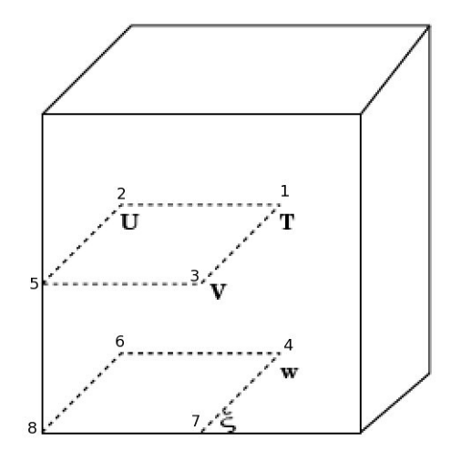

.. _grids:

Grids
================================================

Meso-NH use a C-grid in the Arakawa convention, both on the horizontal and on the vertical. This grid is shown on the following figure :

* 1 : mass points

* 2 : u points

* 3 : v points

* 4 : w points

* 5 : vertical vorticity point

* 6 : vorticity components along y

* 7 : vorticity components along x

   Meso-NH's grids.

.. error::

   point 8 ?
