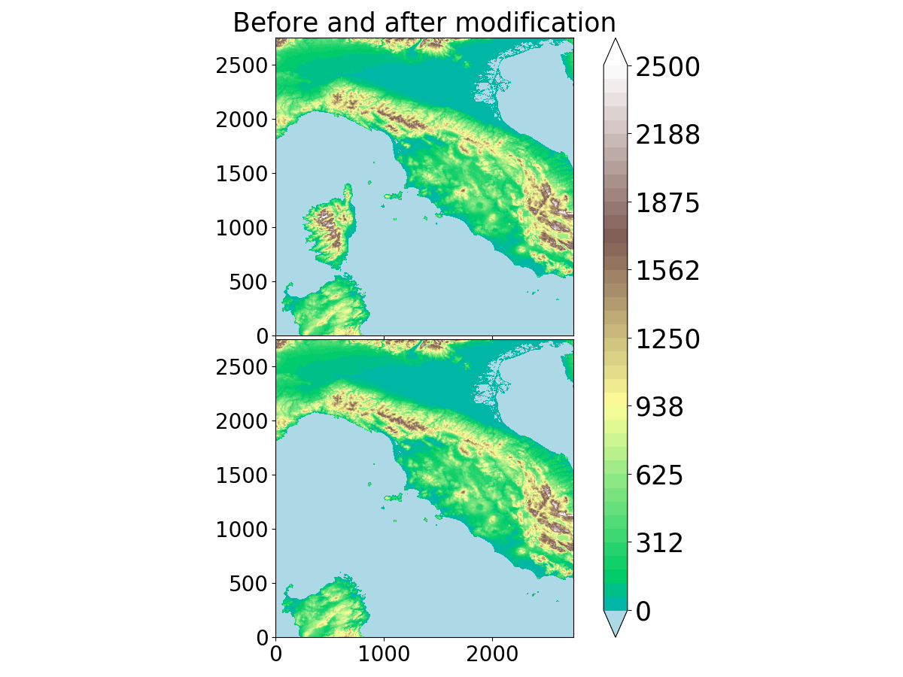

.. _how_to:

How to ?
=============================================================================

Compute altitude of vertical levels
*****************************************************************************

Print the vertical grid computed from PREP_REAL_CASE and PRE_IDEAL_CASE namelist options.
For that, you can copy and run the following python's script :

.. code-block:: python

   # -*- coding: utf-8 -*-

   KMAX=120 #nb levels
   ZMAX=5000 #ZMAX_STRGRD 
   ZGRD=10 # mesh size at the ground ZGRD
   ZTOP=300 # Mesh size at the top ZTOP 
   SGRD=4 # low level stretching SGRD
   STOP=5 # top level stretching STOP
   
   RZ=[0 for i in range(1,KMAX+1)]
   RZ[1]=0.
   RZ[2]=ZGRD
   
   for i in range(2,KMAX-1):
     if RZ[i]<= ZMAX:
       RZ[i+1]=RZ[i] +(RZ[i]-RZ[i-1])* (1+SGRD/100)
     else:
       RZ[i+1]=RZ[i] +(RZ[i]-RZ[i-1])* (1+STOP/100)
       
     if (RZ[i+1]-RZ[i]) >=ZTOP:
       RZ[i+1]=RZ[i]+ZTOP
             
    print(RZ)
    
.. _get_horizontal_grid_point:
    
Get the list of authorized number of horizontal grid points
*****************************************************************************

Print possible values for the horizontal grid size (rule of 2n * 3p * 5q).
For that, you can copy and run the following python's script :

.. code-block:: python

   import numpy as np
   #Max number of exponent for 2,3 and 5
   n2=15
   n3=9
   n5=7
   val=np.zeros([n2*n3*n5+3])
   index=0
   for i in range(n2):
     for j in range(n3):
       for k in range(n5):
         val[index]=(2**i)*(3**j)*(5**k)
         index=index+1
   val.sort()
   np.set_printoptions(formatter={'float': '{: 5.0f}'.format})
   print(val)
   
Suppress the orography
*****************************************************************************   

Use the following script to read and modify any .dir topography database (from SURFEX website) before ingesting the modified topography file at the PGD step.

.. code-block:: python

   #!/usr/bin/env python3
   # -*- coding: utf-8 -*-
   """
   CNRM, Université de Toulouse, Météo-France, CNRS, Toulouse, France
   Created on 12 Avril 2020 - Marc Mandement - marc.mandement@meteo.fr
   Script to modify the binary topography.dir file (tested on srtm_ne_250 and srtm_europe)
   MODIFICATION
   Q. Rodier 17/12/2020 : adapt to any topography .dir database.
   """

   import matplotlib as mpl; mpl.use('Agg')
   import matplotlib.pyplot as plt
   import numpy as np
   from mpl_toolkits.axes_grid1 import AxesGrid

   def truncate_colormap(cmap, minval=0.0, maxval=1.0, n=100):
      n_cm = mpl.colors.LinearSegmentedColormap.from_list('trunc({n},{a:.2f},{b:.2f})'.format(n=cmap.name, a=minval, b=maxval),cmap(np.linspace(minval, maxval, n)))
      return n_cm

   # Warning : the topography file are usually heavy and need > 4Go RAM memory
   directory='/home/rodierq/RELIEF/' # Your directory
   file=directory+'srtm_europe.dir'  # The topography file 

   with open(file, 'rb') as f:
      raw_data=np.fromfile(f,dtype='i2')

   #Read the database
   data=raw_data.reshape((18000,18000)) #This numbers must match the rows and cols written in the .hdr file
   data=data[::-1,::] #Inverse coordinates Y X
   modified_data=np.copy(data)

   # Subset you are interested in (being plotted later), to decrease memory usage and plot
   modified_data=data[3000:7000,5000:9000] #Here is an example of south-west France over the Pyrenees

   #Initial data in the subdomain for plot
   initial_data_sub=np.copy(modified_data)
   #
   #
   # MODIFY YOUR OROGRAPHY HERE
   #
   #
   modified_data[:750,:] = 250. #Example of erase the Pyrenees
   #
   #

   # Plot before and after modification
   cmap = truncate_colormap(plt.get_cmap('terrain'), 0.2, 1)
   cmap.set_under('lightblue')

   # Limit values of contour plot
   vmin,vmax=0,2500

   fig = plt.figure(figsize=(12,9)) 
   ax = AxesGrid(fig, 111, nrows_ncols=(2,1),axes_pad=0.05,cbar_location="right",cbar_mode="single",cbar_size="4%",cbar_pad=0.4)   

   ax[0].contourf(initial_data_sub,np.linspace(vmin,vmax,41),cmap=cmap,vmin=vmin,vmax=vmax,extend='both')
   bb=ax[1].contourf(modified_data,np.linspace(vmin,vmax,41),cmap=cmap,vmin=vmin,vmax=vmax,extend='both')
   ax[0].set_title("Before and after modification",fontsize=25)
   ax[0].tick_params(axis='both',labelsize=20) ; ax[1].tick_params(axis='both',labelsize=20)

   #Colorbar
   cbar=plt.colorbar(bb, cax = ax.cbar_axes[0])
   cbar.ax.tick_params(labelsize=25)

   fig.tight_layout()
   fig.savefig(directory+"Orography.png")
   plt.close()

   #Write the modified orography
   file_modified=directory+'srtm_europe_modif.dir'
   raw_data.tofile(file_modified)

   Example of removing Corsica within the srtm_ne_250 database
   
   
Test code's reproducibility
*****************************************************************************  

(results independent of the number of MPI tasks)

The method consists of running simultaneously the same run with 2 different numbers of MPI tasks. The 2 runs exchange information to check that fields are equal.

**For a MESONH execution :**

* In EXSEG1.nam, in NAM_CONF put LCHECK=.T.

* Create a directory dir_clone_1proc on your run directory and copy run_mesonh_xyz_MPPDB

* Copy mppdb.nam.ihm on your run directory and modify MPPDB_HOST by the name of your machine

* Copy EXSEG1.nam to EXSEG1.nam.ihm, you can then launch run_mesonh_xyz_MPPDB and differences between the 2 runs will be printed. 

**For another step than the MESONH execution :**

Instead of using LCHECK, you have to add check points in the source code by introducing USE MODE_MPPDB and calls to MPPDB_CHECK2D or MPPDB_CHECK3D. By example in ver_thermo.f90 :

.. code-block:: fortran

   CALL MPPDB_CHECK2D(PZSMT_LS,"ver_thermo:PZSMT_LS",PRECISION)
   CALL MPPDB_CHECK3D(PZMASS_MX,"ver_thermo:PZMASS_MX",PRECISION)
   
then recompile your modified code, and then execute the steps 2 to 4 as previously after adapting to PREP_REAL_CASE or DIAG or ...

:file:`run_mesonh_xyz_MPPDB` script :

 .. code-block:: bash
 
    set -x
    set -e
    ln -fs ../001_prep_ideal_case/EI* .
    ln -fs ../001_prep_ideal_case/fichier* .
    rm -f BSPLI*

    export CLONE_DIR=dir_clone_1proc

    export NPROC=2

    export MPIRUN=" mpirun -np ${NPROC} "

    export CSEG=TPNXX

    eval_dollar  EXSEG1.nam.ihm > EXSEG1.nam

    #
    # prepare env for clone
    #

    eval_dollar mppdb.nam.ihm > mppdb.nam

    mkdir -p ${CLONE_DIR}

    (
    cd  ${CLONE_DIR} 
    cp  ../EXSEG1.nam .
    rm -f REL3D.*  OUT* BSPLI*
    ln -sf ../EI* .                                         
    ln -sf ../fichier* .                                         
    )

    time ${MPIRUN} ${SRC_MESONH}/exe/MESONH${XYZ}

    exit 

    ln -sf ${CLONE_DIR}/REL3D.1.${CSEG}.001.lfi REL3D.1.${CSEG}.001.CLONE.lfi
    
:file:`mppdb.nam.ihm` namelist :
    
.. code-block:: fortran
 
   &NAM_MPPDB
   MPPDB_DEBUG = .TRUE. ,
   MPPDB_EXEC = "${SRC_MESONH}/exe/MESONH${XYZ}" , 
   MPPDB_HOST = "pxmnh3",             
   MPPDB_WDIR = "${PWD}/${CLONE_DIR}"
   /
    
    
Generate the tree of Meso-NH (Doxygen)
*****************************************************************************  

Install Doxygen
-----------------------------------------------------------------------------

.. tip::

   You can install Doxygen automatically or manually by following the procedure described below. Last version tested is version 1.13.2 released on 9 January 2025.

First ensure that you have the necessary build tools installed (e.g., g++, Python, CMake, Flex, Bison, Graphviz), then follow these steps:

.. code-block:: bash

   git clone https://github.com/doxygen/doxygen.git
   cd doxygen
   git checkout Release_1_13_2
   mkdir build
   cd build
   cmake -G "Unix Makefiles" ..
   make

To force a fresh build after an earlier check-out simple remove the build directory and redo the steps above.

After the binaries have been built, you can install them with:

.. code-block:: bash

   make install

.. tip::

   If you don't have the permission to link the executable into the bin directory, you can use absolute path to launch Doxygen (doxygen/build/bin/doxygen).

Use Doxygen with Meso-NH
-----------------------------------------------------------------------------

To generate the Doxygen documentation of Meso-NH, you need a configuration file such as :download:`Doxyfile_MesoNH <how_to/Doxyfile_MesoNH>`.

.. note::

   Depending of the version of Doxygen you use, you probably need to update this file. You can do that with:

   .. code-block:: bash

      doxygen -u Doxyfile_MesoNH

In the Doxyfile_MesoNH file, change all the YOURPATHTOMNH mention to your own path to the Meso-NH folder.

Then, generate the documentation with

.. code-block:: bash

   doxygen Doxyfile_MesoNH

You can now open the documentation in a web-browser by loading the file /doxygen_mesonh_doc/index.html.

If you have trouble to generate the tree, the documentation is available on demand (~1.2 Go) at mesonhsupport .at. obs-mip.fr

