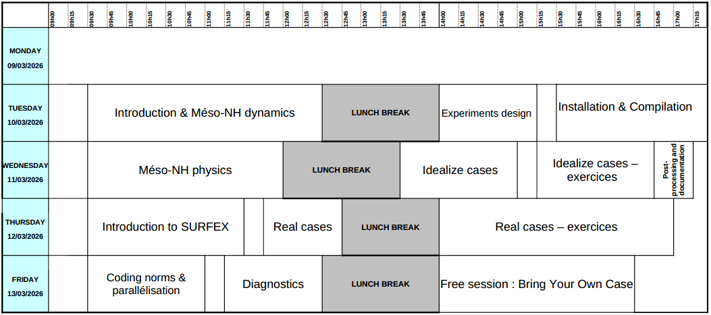

Tutorial material
==============================================================================

A 4-day tutorial class is organized two times a year at Toulouse (France) :

* A session in November is only in face-to-face and presentations are in French (materials in English).

* A session in March is in hybrid (face-to-face + remote) and presentations are in English.

.. note::

   The next tutorial will be held on 10-13 March 2026 (registration deadline 19th February). For more information (application and registration), send an email to quentin.rodier .at. meteo.fr. 

Agenda
------------------------------------------------------------------------------

   
Material
------------------------------------------------------------------------------
   
* :download:`Dynamics and Physics <tutorial_material/Dynamics_and_Physics.pdf>`

* :download:`Radiation <tutorial_material/Radiation.pdf>`

* :download:`Meso-NH environment <tutorial_material/env.pdf>`

* :download:`Ideal cases <tutorial_material/cas_ideal.pdf>`

* :download:`Real cases <tutorial_material/cas_reel.pdf>`

* :download:`SURFEX for Meso-NH <tutorial_material/surfex_for_mnh.pdf>`

* :download:`Coding rules <tutorial_material/coding_in_MNH.pdf>`

* :download:`Diagnostics <tutorial_material/diag.pdf>`

* :download:`Documentation <tutorial_material/documentation.pdf>`

* :download:`Post-processing <tutorial_material/postprocessing.pdf>`

* :download:`Exercise for ideal cases <tutorial_material/tp_ideal.pdf>`

* :download:`Exercise for real cases <tutorial_material/tp_reel.pdf>`

* :download:`Bring your own case <tutorial_material/BYOC.pdf>`

Support for exercises
------------------------------------------------------------------------------

* `Exercise for ideal case <http://mesonh.aero.obs-mip.fr/mesonh57/MesonhTutorial?action=AttachFile&do=get&target=tp_ideal_makefile.tar>`_

* `Solution for ideal case <http://mesonh.aero.obs-mip.fr/mesonh57/MesonhTutorial?action=AttachFile&do=get&target=tp_ideal_solution.tar>`_

* `Exercise for real case <http://mesonh.aero.obs-mip.fr/mesonh57/MesonhTutorial?action=AttachFile&do=get&target=tp_real_makefile.tar>`_

* `Solution for real case <http://mesonh.aero.obs-mip.fr/mesonh57/MesonhTutorial?action=AttachFile&do=get&target=tp_real_solution.tar>`_

* `Script to get PGD files <http://mesonh.aero.obs-mip.fr/mesonh57/MesonhTutorial?action=AttachFile&do=view&target=get_pgd_files>`_
