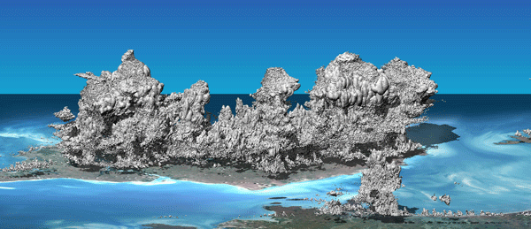

Examples
============================================

Add figure
********************************************

   Example with Hector the convector.

Add equation
********************************************

.. math::
   e^{i\pi} + 1 = 0
   :label: euler

Euler's identity, equation :eq:`euler`, was elected one of the most
beautiful mathematical formulas.

.. math::
   \frac{\partial \rho}{\partial t} + \frac{\partial \rho U_i}{\partial x_i} = 0
   :label: continuity

An other example :

.. math::
   :nowrap:

   \begin{eqnarray}
      y    & = & ax^2 + bx + c \\
      f(x) & = & x^2 + 2xy + y^2
   \end{eqnarray}

Add reference
********************************************

Example with :cite:p:`voldoire_surfex_2017,lac_mesonh_2018`.

