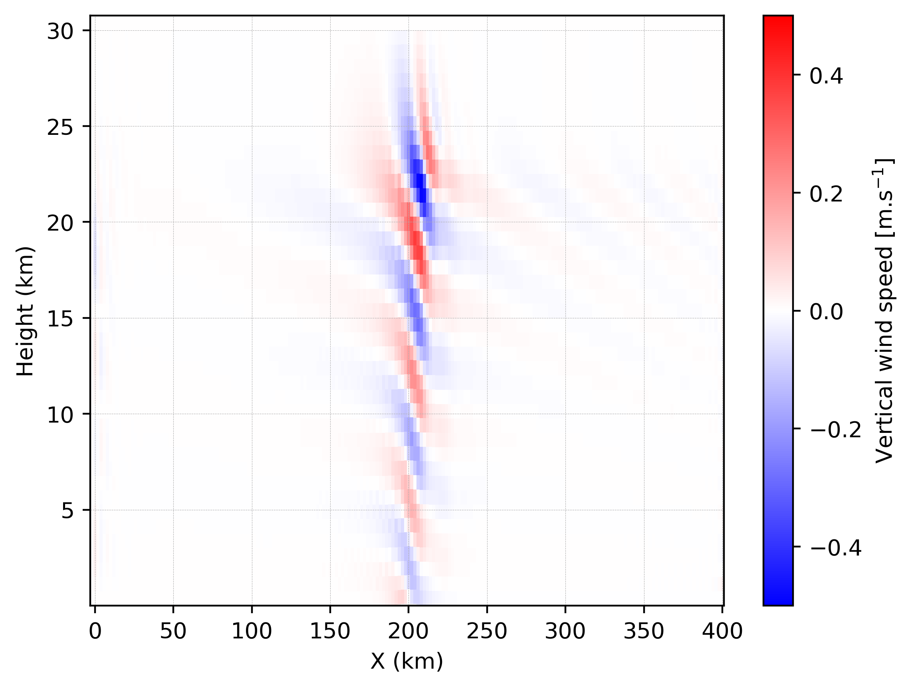

Two dimensional (cross-section xz or yz) with ideal surface
==================================================================

2D simulation is a powerful compromise between 1D and 3D simulations : it retains both horizontal and vertical dimensions, allowing a large number of atmospheric phenomena to be represented without the significant cost of a 3D simulation. 2D configurations are able to study free convection, thermals, gravity waves, 2D turbulence, ...

To perform a 2D simulation with Meso-NH you need to :ref:`prepare the initial condition <2d_prep_ideal_case>` and :ref:`run the model <2d_mesonh>` using the :ref:`prep_ideal_case` and :ref:`mesonh` executables respectively. These two steps are described in the following sections:

.. contents::
   :local:
   :depth: 1
   :backlinks: top

.. warning::

   This kind of simulation is not parallelized and can only be run on 1 core.

.. note::

   You can find all the namelists presented in this section as well as the scripts here:

   .. treeview::
   
      - :dir:`folder` |MNH_directory_extract_current|/MY_RUN/tutorials/ideal_cases/2D/
      
        - :dir:`folder` 001_prep_ideal_case : directory to :ref:`prepare the initial condition <2d_prep_ideal_case>`
        - :dir:`folder` 002_mesonh : directory to :ref:`run the model <2d_mesonh>`
        - :dir:`folder` 003_python : directory to :ref:`plot the figure <2d_plot>`

   The different steps must be performed in the order indicated by the directory numbers.

.. _2d_prep_ideal_case:

Prepare the initial condition (:ref:`prep_ideal_case`)
------------------------------------------------------------------

To create the initial condition for a 2D Meso-NH simulation you have to use :ref:`prep_ideal_case` program. This program reads a file called :file:`PRE_IDEA1.nam` defining the characteristics of the simulation.

.. tip::

   To see all the namelists you can use in the :ref:`prep_ideal_case` program or to obtain information about namelists, please go :ref:`here <executables_and_namelists>`.

In the :file:`PRE_IDEA1.nam` file, we recommend to have the following minimum informations and namelists:

* The name of the NetCDF files you will create with the :ref:`prep_ideal_case` program (without the extension) in :ref:`NAM_LUNITn <nam_lunitn>` namelist:

  .. code:: fortran

     &NAM_LUNITn CINIFILE    = "INI",
                 CINIFILEPGD = "PGD" /

  .. note::

     In this example, you will create the two NetCDF files :file:`INI.nc` and :file:`PGD.nc` corresponding respectively to initial and surface boundary conditions files.

* The number of points along x (i) and y (j) direction (it has to be 1 for one direction for 2D configuration) in :ref:`NAM_DIMn_PRE <nam_dimn_pre>` namelist:

  .. code:: fortran

     &NAM_DIMn_PRE NIMAX = 200,
                   NJMAX = 1 /

  .. note::

     In this example, you will have a x-z domain.

* The type of initial profile and the shape of the orography you will impose in :ref:`NAM_CONF_PRE <nam_conf_pre>` :

  .. code:: fortran

     &NAM_CONF_PRE CIDEAL = "RSOU",
                   CZS    = "BELL" /

  .. note::

     * In this example, you will use initialization from radiosounding (:code:`CIDEAL="RSOU"`) and bell-shape hill orography (:code:`CZS="BELL"`).
     
     * Characteristic of radiosounding has to be defined in the :ref:`freeformat part <freeformat_prep_ideal_case>` of the :file:`PRE_IDEA1.nam` file (cf below).
     
     * Characteristic of the bell-shape hill orography has to be defined in :ref:`NAM_GRIDH_PRE <nam_gridh_pre>` namelist. 

* The horizontal resolution along i and j direction and the orography charateristic in :ref:`NAM_GRIDH_PRE <nam_gridh_pre>` namelist:

  .. code:: fortran

     &NAM_GRIDH_PRE XDELTAX = 2000.,
                    XDELTAY = 2000.,
                    XHMAX   = 100.,
                    XAX     = 8000.,
                    NIZS    = 100 /

  .. note::

     It is better to set XDELTAX and XDELTAY to a value that is consistent with the relevant resolution of the your case study. XHMAX, XAX and NIZS correspond to characteristic of the bell-shape hill you've chose in :ref:`NAM_CONF_PRE <nam_conf_pre>` namelist.

* The vertical grid discretisation in :ref:`NAM_VER_GRID <nam_ver_grid>` namelist:

  .. code:: fortran

     &NAM_VER_GRID NKMAX  = 40,
                   ZDZGRD = 750.,
                   ZDZTOP = 750. /

  .. note::

     In this example, you will use 40 vertical grid points with a vertical resolution of 750 m everywhere.

* The kind of lateral boundary condition in :ref:`NAM_LBCn_PRE <nam_lbcn_pre>` namelist:

  .. code:: fortran

     &NAM_LBCn_PRE CLBCX(1) = "CYCL",
                   CLBCX(2) = "CYCL" /
                   
  .. note::

     In this example, you will use cyclic lateral boundary condition in :ref:`prep_ideal_case` to impose cyclic orography.

* The surface representation in :ref:`NAM_GRn_PRE <nam_grn_pre>` and :ref:`NAM_COVER <nam_cover>` namelists:

  .. code:: fortran

     &NAM_GRn_PRE CSURF        = "EXTE" /
     &NAM_COVER XUNIF_COVER(4) =  1.0   /

  .. note::

     In this example, you will use SURFEX (:code:`CSURF = "EXTE"`) and a cover containing 100 % nature points (:code:`XUNIF_COVER(4) = 1.0`).

* The characteristic of the vertical profile is given in the :ref:`freeformat part <freeformat_prep_ideal_case>` of the :file:`PRE_IDEA1.nam` file:

  .. code:: fortran

     RSOU
     2025 6 11 0.
     "ZUVTHVHU"
     0.
     100000.
     288.
     0.

     2
     0        10      0
     30000    10      0

     2
        50.0    288.15  0.0
     29900.0    390.68  0.0

  .. note::

     In this example you will impose an u-wind speed of 10 m/s, a relative humidty of 0 % (dry simulation) and a regular increase of the potential temperature from 288 K at 0 m to 390.68 K at 29900 m.

.. tip::

   See the full :file:`PRE_IDEA1.nam` file:
   
   .. toggle::

      .. code-block:: fortran

         &NAM_LUNITn CINIFILE    = "INI",
                     CINIFILEPGD = "PGD" /

         &NAM_DIMn_PRE NIMAX = 200,
                       NJMAX = 1 /
                       
         &NAM_CONF_PRE CIDEAL = "RSOU",
                       CZS    = "BELL" /

         &NAM_GRIDH_PRE XDELTAX = 2000.,
                        XDELTAY = 2000.,
                        XHMAX   = 100.,
                        XAX     = 8000.,
                        NIZS    = 100 /

         &NAM_VER_GRID NKMAX  = 40,
                       ZDZGRD = 750.,
                       ZDZTOP = 750. /

         &NAM_LBCn_PRE CLBCX(1) = "CYCL",
                       CLBCX(2) = "CYCL" /

         &NAM_GRn_PRE CSURF        = "EXTE" /
         &NAM_COVER XUNIF_COVER(4) =  1.0   /

         RSOU
         2025 6 11 0.
         "ZUVTHVHU"
         0.
         100000.
         288.
         0.

         2
         0        10      0
         30000    10      0

         2
            50.0    288.15  0.0
         29900.0    390.68  0.0

   This file is located here :

   .. code-block:: bash
      :substitutions:   

      |MNH_directory_extract_current|/MY_RUN/tutorials/ideal_cases/2D/001_prep_ideal_case/

You can launch :ref:`prep_ideal_case` program using :file:`run_prep_ideal_case.sh` script (execution takes approximately 2 s):

.. code-block:: bash
   :substitutions:

   cd |MNH_directory_extract_current|/MY_RUN/tutorials/2D/001_prep_ideal_case/
   ./run_prep_ideal_case.sh

At the end of the :ref:`prep_ideal_case` execution, you need to have following files:

.. role:: gray
   :class: text-gray

.. treeview::

   - :dir:`folder` |MNH_directory_extract_current|/MY_RUN/tutorials/ideal_cases/2D/001_prep_ideal_case/

     - :dir:`file` PRE_IDEA1.nam :gray:`: The file you've created from this example`
     - :dir:`file` INI.des :gray:`: The descriptive part of the initial condition file`
     - :dir:`file` INI.nc :gray:`: The NetCDF part of the initial condition file`
     - :dir:`file` PGD.nc :gray:`: The NetCDF part of the physiographic data file`
     - :dir:`file` OUTPUT_LISTING1 :gray:`: File containing debug informations`

.. tip::

   To verify that the program has been executed correctly, you should see the following lines at the end of the :file:`OUTPUT_LISTING1` file:

   .. code-block:: bash

      ****************************************************
      * PREP_IDEAL_CASE: PREP_IDEAL_CASE ENDS CORRECTLY. *
      ****************************************************

.. _2d_mesonh:

Launch the simulation (:ref:`mesonh`)
-----------------------------------------------------------------

To launch the Meso-NH simulation you have to use :ref:`mesonh` program. This program reads a file called :file:`EXSEG1.nam` defining the characteristics of the simulation.

.. tip::

   To see all the namelists you can use in the :ref:`mesonh` program or to obtain information about namelists, please go :ref:`here <executables_and_namelists>`.

In the :file:`EXSEG1.nam` file, we recommend to have the following minimum informations and namelists:

* The name of the NetCDF files created by the :ref:`prep_ideal_case` program in :ref:`NAM_LUNITn <nam_lunitn>` namelist:

  .. code:: fortran

     &NAM_LUNITn CINIFILE    = "INI",
                 CINIFILEPGD = "PGD" /

* The simulated length (in s), the activation of Coriolis effect and the top absorbing layer coefficient in :ref:`NAM_DYN <nam_dyn>` namelist :

  .. code:: fortran

     &NAM_DYN XSEGLEN = 36000.,
              LCORIO  = .FALSE.,
              XALKTOP = 0.005,
              XALZBOT = 20000. /

  .. note::

     To activate the top absorbing layer you have to put :code:`LVE_RELAX = .TRUE.` in :ref:`NAM_DYNn <nam_dynn>` namelist.

* The backup output writing period in :ref:`NAM_BACKUP <nam_backup>` namelist:

  .. code:: fortran

     &NAM_BACKUP XBAK_TIME(1,1) = 36000.0 /

* The time step, pressure solver option and the activation of the top absorbing layer in :ref:`NAM_DYNn <nam_dynn>` namelist:

  .. code:: fortran

     &NAM_DYNn XTSTEP    = 20.,
               CPRESOPT  = "CRESI",
               LVE_RELAX = .TRUE. /

* The temporal and advection schemes in :ref:`NAM_ADVn <nam_advn>` namelist:

  .. code:: fortran

     &NAM_ADVn CTEMP_SCHEME    = "RKC4",
               CUVW_ADV_SCHEME = "CEN4TH",
               CMET_ADV_SCHEME = "PPM_01" /

* The physical parametrization options in :ref:`NAM_PARAMn <nam_paramn>` namelist:

  .. code:: fortran

         &NAM_PARAMn CTURB  = "NONE",
                     CRAD   = "NONE",
                     CCLOUD = "NONE",
                     CSCONV = "NONE",
                     CDCONV = "NONE" /

  .. note::

     In this example, no physical parameters are activated.
     
* The lateral boundary condition options :ref:`NAM_LBCn <nam_lbcn>` namelist:

  .. code:: fortran
  
     &NAM_LBCn CLBCX = 2*"OPEN" /

  .. note::

     In this example you will use open boundary condition in i direction, by default it's cyclic along j direction.

.. tip::

   See the full :file:`EXSEG1.nam` file:
   
   .. toggle::

      .. code-block:: fortran

         &NAM_LUNITn CINIFILE    = "INI" ,
                     CINIFILEPGD = "PGD" /

         &NAM_DYN XSEGLEN = 36000.,
                  LCORIO  = .FALSE.,
                  XALKTOP = 0.005,
                  XALZBOT = 20000. /

         &NAM_BACKUP XBAK_TIME(1,1) = 36000. /

         &NAM_DYNn XTSTEP    = 20.,
                   CPRESOPT  = "CRESI",
                   LVE_RELAX = .TRUE. /

         &NAM_ADVn CTEMP_SCHEME    = "RKC4",
                   CUVW_ADV_SCHEME = "CEN4TH",
                   CMET_ADV_SCHEME = "PPM_01" /

         &NAM_PARAMn CTURB  = "NONE",
                     CRAD   = "NONE",
                     CCLOUD = "NONE",
                     CSCONV = "NONE",
                     CDCONV = "NONE" /

         &NAM_LBCn CLBCX = 2*"OPEN" /

   This file is located here :

   .. code-block:: bash
      :substitutions:   
         
      |MNH_directory_extract_current|/MY_RUN/tutorials/ideal_cases/2D/002_mesonh/

Once you have put these namelist in the :file:`EXSEG1.nam` file, you can launch :ref:`mesonh` program in the same directory as the :file:`EXSEG1.nam`, :file:`INI.des`, :file:`INI.nc` and :file:`PGD.nc` files (execution takes approximately 1 min 30):

.. code-block:: bash
   :substitutions:

   cd |MNH_directory_extract_current|/MY_RUN/tutorials/ideal_cases/2D/002_mesonh/
   ./run_mesonh.sh

At the end of the :ref:`mesonh` execution, you need to have following files:

.. role:: gray
   :class: text-gray

.. treeview::

   - :dir:`folder` your_run_directory/

     - :dir:`file` INI.des :gray:`: The descriptive part of the initial condition file`
     - :dir:`file` INI.nc :gray:`: The NetCDF part of the initial condition file`
     - :dir:`file` PGD.nc :gray:`: The NetCDF part of the physiographic data file`
     - :dir:`file` EXSEG1.nam :gray:`: The file you've created from this example`
     - :dir:`file` EXP01.1.SEG01.000.des :gray:`: The descriptive part of the simulated output file`
     - :dir:`file` EXP01.1.SEG01.000.nc :gray:`: The NetCDF part of the simulated output file`
     - :dir:`file` EXP01.1.SEG01.001.des :gray:`: The descriptive part of the simulated output file`
     - :dir:`file` EXP01.1.SEG01.001.nc :gray:`: The NetCDF part of the simulated output file`
     - :dir:`file` OUTPUT_LISTING0 :gray:`: File containing debug informations`
     - :dir:`file` OUTPUT_LISTING1 :gray:`: File containing debug informations`

.. tip::

   * The *.001.nc file contains :ref:`NAM_BACKUP <nam_backup>` output. This file can be used to restart the simulation. It contains one time variables.

   * To verify that the program has been executed correctly, you should see the following lines at the end of the :file:`OUTPUT_LISTING1` file:

     .. code-block:: bash

        |----------------------------------------------------------------------------------------------------|
        |     CPUTIME/ELAPSED                   ||   SUM(PROC)   |MEAN(PROC)| MIN(PROC | MAX(PROC)| PERCENT %|
        |----------------------------------------------------------------------------------------------------|
        |++++++++++++++++++++++++++++++++++++++++++++++++++++++++++++++++++++++++++++++++++++++++++++++++++++|
        |++++++++++++++++++++++++++++++++++++++++++++++++++++++++++++++++++++++++++++++++++++++++++++++++++++|
        |++++++++++++++++++++++++++++++++++++++++++++++++++++++++++++++++++++++++++++++++++++++++++++++++++++|
        | MODEL1                      | CPUTIME ||         93.270|    93.270|    93.270|    93.270|   100.000|
        | MODEL1                      | ELAPSED ||         93.407|    93.407|    93.407|    93.407|   100.000|
        |++++++++++++++++++++++++++++++++++++++++++++++++++++++++++++++++++++++++++++++++++++++++++++++++++++|
        |++++++++++++++++++++++++++++++++++++++++++++++++++++++++++++++++++++++++++++++++++++++++++++++++++++|
        |++++++++++++++++++++++++++++++++++++++++++++++++++++++++++++++++++++++++++++++++++++++++++++++++++++|
        |====================================================================================================|
        | SECOND/STEP=1801            | CPUTIME ||          0.052|     0.052|     0.052|     0.052|     0.056|
        | SECOND/STEP=1801            | ELAPSED ||          0.052|     0.052|     0.052|     0.052|     0.056|
        |----------------------------------------------------------------------------------------------------|
        | MICROSEC/STP/PT=8000        | CPUTIME ||          6.474|     6.474|     6.474|     6.474|   100.000|
        | MICROSEC/STP/PT=8000        | ELAPSED ||          6.483|     6.483|     6.483|     6.483|   100.000|
        |====================================================================================================|

.. _2d_plot:

Plot results
-----------------------------------------------------------------

You can plot the results using :file:`run_python.sh` script (execution takes less than few seconds):

.. code-block:: bash
   :substitutions:

   cd |MNH_directory_extract_current|/MY_RUN/tutorials/ideal_cases/2D/003_python/
   ./run_python.sh

The figure created visible below shows an example of a graph that you can plot from the 2D simulation you just performed. It shows the orographic wave generated by the 100 m bell shape hill through vertical velocity wind speed along x-z domain.

   Example of 2D simulation output. Vertical wind velocity along cross section.

.. tip::

   See the python script used to plot this figure:

   .. toggle::
     
      .. code-block:: python

         #!/usr/bin/python
         # -*- coding: utf-8 -*-

         # ~~~~~~~~~~~~~~~~~~~~~~~~~~~~~~~~~~~~~~~~~~~~~~~~~~~~~~~~~
         import numpy as np
         import netCDF4
         import matplotlib.pyplot as plt
         # ~~~~~~~~~~~~~~~~~~~~~~~~~~~~~~~~~~~~~~~~~~~~~~~~~~~~~~~~~

         # #########################################################
         # ###           To be defined by user                   ###
         # #########################################################

         cfg_file_name = 'EXP01.1.SEG01.001.nc'

         # #########################################################

         # ------------------------------------------------------
         #   Read netcdf file and variables
         # ------------------------------------------------------

         file_MNH     = netCDF4.Dataset(cfg_file_name)

         xhat_MNH     = file_MNH['XHAT']
         levels_MNH   = file_MNH['level_w'][1:]
         x_MNH, z_MNH = np.meshgrid(xhat_MNH, levels_MNH)

         zs_MNH       = file_MNH['ZS']
         ztop_MNH     = 30000.0
         wwnd_MNH     = file_MNH['WT'][0,1:,:]

         # ------------------------------------------------------
         #   Convert xhat, yhat, zs to alt
         # ------------------------------------------------------

         altitude = np.zeros((len(levels_MNH),len(xhat_MNH)))

         for ind_i in range(len(xhat_MNH)):
           for ind_k in range(len(levels_MNH)):
             altitude[ind_k, ind_i] = zs_MNH[ind_i] + levels_MNH[ind_k] * ((ztop_MNH - zs_MNH[ind_i]) / ztop_MNH)

         # ------------------------------------------------------
         #   Quick plot
         # ------------------------------------------------------

         plt.pcolormesh(x_MNH[:,:]/1000.0, (altitude[:,:]+750.0/2.0)/1000.0, wwnd_MNH[:,:], vmin=-0.5, vmax=0.5, shading="auto", cmap="bwr")

         # ------------------------------------------------------
         #   Some adjustments to the plot
         # ------------------------------------------------------

         plt.grid(True, linestyle='--', linewidth=0.2)

         cbar=plt.colorbar()
         cbar.set_label(r"Vertical wind speed [m.s$^{-1}$]")

         plt.xlabel("X (km)")
         plt.ylabel("Height (km)")

         plt.savefig('2D_orographic_wave.png', bbox_inches='tight', dpi=400)                                                                    

   This file is located here :

   .. code-block:: bash
      :substitutions:   
         
      |MNH_directory_extract_current|/MY_RUN/tutorials/ideal_cases/2D/003_python/

Other examples
-----------------------------------------------------------------

You can find other 2D simulation examples in :ref:`cases_catalogue` section.
