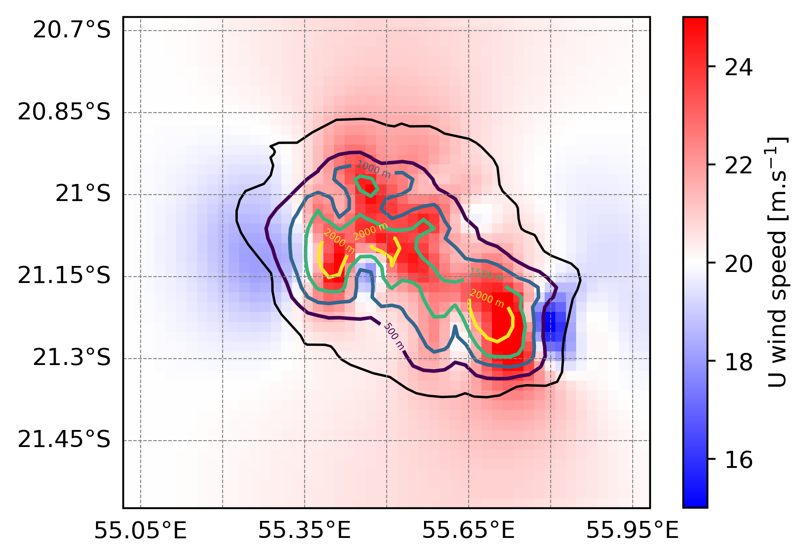

Three dimensional (xyz) with real surface
==================================================================

3D Meso-NH simulations capture full spatial dynamics, including complex interactions between terrain, convection, and surface heterogeneity. They allow to study organized atmospheric structures that 1D or 2D models cannot represent. In this example you will use idealized initial condition and real surface condition.

To perform a 3D simulation with Meso-NH with idealized initial condition and real surface condition you need to :ref:`prepare the physiographic data <3d_prep_pgd>`, :ref:`prepare the initial condition <3d_prep_ideal_case_real_surface>` and :ref:`run the model <3d_mesonh_real_surface>` using the :ref:`prep_pgd`, :ref:`prep_ideal_case` and :ref:`mesonh` executables respectively. In this example you will also use the :ref:`diag` program to :ref:`calculate diagnostics after the simulation <3d_diag_real_surface>`. These steps are described in the following sections.

.. warning::

   This kind of simulation is parallelized and can be run with more than 1 core.

.. _3d_prep_pgd:

Prepare the physiographic data (:ref:`prep_pgd`)
------------------------------------------------------------------

To create the physiographic file for a 3D Meso-NH simulation you have to use :ref:`prep_pgd` program. This program reads a file called :file:`PRE_PGD1.nam` defining the characteristics of the simulation.

.. tip::

   To see all the namelists you can use in the :ref:`prep_pgd` program or to obtain information about namelists, please go :ref:`here <executables_and_namelists>`.

In the :file:`PRE_PGD1.nam` file, we recommend to have the following minimum informations and namelists:

* The name of the NetCDF file you will create with the :ref:`prep_pgd` program (without the extension) in :ref:`NAM_PGDFILE <nam_pgdfile>` namelist:

  .. code:: fortran

     &NAM_PGDFILE CPGDFILE = "PGD" /

  .. note::

     In this example, you will create a NetCDF file :file:`PGD.nc` corresponding to surface boundary conditions files.

* The kind of desired projection you will use in :ref:`NAM_PGD_GRID <nam_pgd_grid>` namelist:

  .. code:: fortran

     &NAM_PGD_GRID CGRID = "CONF PROJ" /

  .. note::

     In this example, you will use conformal projection and you also need to define charastetics of this projection filling :ref:`NAM_CONF_PROJ <nam_conf_proj>` and :ref:`NAM_CONF_PROJ_GRID <nam_conf_proj_grid>` namelists.

* The characteristic of the conformal projection in :ref:`NAM_CONF_PROJ <nam_conf_proj>` namelist:

  .. code:: fortran
  
     &NAM_CONF_PROJ XLAT0 = -21.125,
                    XLON0 = 55.5,
                    XRPK  = 0.,
                    XBETA = 0. /

* The characteristic of the conformal projection grid in :ref:`NAM_CONF_PROJ_GRID <nam_conf_proj_grid>` namelist:

  .. code:: fortran
  
     &NAM_CONF_PROJ_GRID XLATCEN = -21.125,
                         XLONCEN = 55.5,
                         NIMAX   = 50,
                         NJMAX   = 50,
                         XDX     = 2000.,
                         XDY     = 2000. /

  .. note::

     In this example, you will use a grid of 50x50 horizontal grid points, with a horizontal resolution of 2 km and the domain will be centered in La Reunion Island (lon=55.5, lat=-21.125).
     
* The kind of cover database you want to use in :ref:`NAM_COVER <nam_cover>` namelist:

  .. code:: fortran
  
     &NAM_COVER YCOVER         = "ECOCLIMAP_v2.0",
                YCOVERFILETYPE = "DIRECT" /

  .. note::

     In this example, you will use ECOCLIMAP_v2.0 database with more than 200 covers at 1 km horizontal resolution. Other database can be found `here <https://www.umr-cnrm.fr/surfex/spip.php?article136>`_.

* The kind of orography database you want to use in :ref:`NAM_ZS <nam_zs>` namelist:

  .. code:: fortran
  
     &NAM_ZS YZS         = "gtopo30",
             YZSFILETYPE = "DIRECT" /

  .. note::

     In this example, you will use gtopo30 database at approximately 1 km horizontal resolution. Other database can be found `here <https://www.umr-cnrm.fr/surfex/spip.php?article134>`_.

* The kind of clay and sand database you want to use in :ref:`NAM_ISBA <nam_isba>` namelist:

  .. code:: fortran
  
     &NAM_ISBA YCLAY         = "CLAY_HWSD_MOY",
               YCLAYFILETYPE = "DIRECT",
               YSAND         = "SAND_HWSD_MOY",
               YSANDFILETYPE = "DIRECT" /

  .. note::

     In this example, you will use CLAY_HWSD_MOY and  SAND_HWSD_MOY database at 1 km horizontal resolution. Other database can be found `here <https://www.umr-cnrm.fr/surfex/spip.php?article135>`_.

.. tip::

   See the full :file:`PRE_PGD1.nam` file:
   
   .. toggle::

      .. code-block:: fortran

         &NAM_PGDFILE CPGDFILE = "PGD" /
  
         &NAM_PGD_GRID CGRID = "CONF PROJ" /

         &NAM_CONF_PROJ XLAT0 = -21.125,
                        XLON0 = 55.5,
                        XRPK  = 0.,
                        XBETA = 0. /

         &NAM_CONF_PROJ_GRID XLATCEN = -21.125,
                             XLONCEN = 55.5,
                             NIMAX   = 50,
                             NJMAX   = 50,
                             XDX     = 2000.,
                             XDY     = 2000. /

         &NAM_COVER YCOVER         = "ECOCLIMAP_v2.0",
                    YCOVERFILETYPE = "DIRECT" /

         &NAM_ZS YZS         = "gtopo30",
                 YZSFILETYPE = "DIRECT" /

         &NAM_ISBA YCLAY         = "CLAY_HWSD_MOY",
                   YCLAYFILETYPE = "DIRECT",
                   YSAND         = "SAND_HWSD_MOY",
                   YSANDFILETYPE = "DIRECT" /

Once you have put these namelist in the :file:`PRE_PGD1.nam` file, you can launch :ref:`prep_pgd` program in the same directory as the :file:`PRE_PGD1.nam` file (execution takes approximately 2 s):

.. code-block:: bash
   :substitutions:

   source |MNH_directory_extract_current|/conf/profile_mesonh
   PREP_PGD${XYZ}

At the end of the :ref:`prep_pgd` execution, you need to have following files:

.. role:: gray
   :class: text-gray

.. treeview::

   - :dir:`folder` your_run_directory/

     - :dir:`file` PRE_PGD1.nam :gray:`: The file you've created from this example`
     - :dir:`file` PGD.nc :gray:`: The NetCDF part of the physiographic data file`
     - :dir:`file` OUTPUT_LISTING0 :gray:`: File containing debug informations`

.. tip::

   To verify that the program has been executed correctly, you should see the following lines at the end of the :file:`OUTPUT_LISTING0` file:

   .. code-block:: bash

      ***************************
      * PREP_PGD ends correctly *
      ***************************

.. _3d_prep_ideal_case_real_surface:

Prepare the initial condition (:ref:`prep_ideal_case`)
------------------------------------------------------------------

To create the initial condition for a 3D Meso-NH simulation you have to use :ref:`prep_ideal_case` program. This program reads a file called :file:`PRE_IDEA1.nam` defining the characteristics of the simulation.

.. tip::

   To see all the namelists you can use in the :ref:`prep_ideal_case` program or to obtain information about namelists, please go :ref:`here <executables_and_namelists>`.

In the :file:`PRE_IDEA1.nam` file, we recommend to have the following minimum informations and namelists:

* The name of the NetCDF files you will create with the :ref:`prep_ideal_case` program (without the extension) in :ref:`NAM_LUNITn <nam_lunitn>` namelist:

  .. code:: fortran

     &NAM_LUNITn CINIFILE = "INI" /

  .. note::

     In this example, you will create a NetCDF file :file:`INI.nc` corresponding to initial condition file.

* The information about PGD file created in previous section in :ref:`NAM_REAL_PGD <nam_real_pgd>` namelist:

  .. code:: fortran
  
     &NAM_REAL_PGD CPGD_FILE          = "PGD",
                   LREAD_ZS           = .TRUE.,
                   LREAD_GROUND_PARAM = .TRUE. /

* The vertical grid discretisation in :ref:`NAM_VER_GRID <nam_ver_grid>` namelist:

  .. code:: fortran

     &NAM_VER_GRID NKMAX   = 50,
                   ZDZGRD  = 50.,
                   ZDZTOP  = 700.,
                   ZSTRGRD = 2500.,
                   ZSTRGRD = 9.,
                   ZSTRTOP = 7. /

  .. note::

     In this example, you will use 50 vertical grid points with a vertical resolution of 50 m close to the ground and a strecthing until the top of the domain with a maximum grid spacing of 700 m.

* The kind of lateral boundary condition in :ref:`NAM_LBCn_PRE <nam_lbcn_pre>` namelist:

  .. code:: fortran

     &NAM_LBCn_PRE CLBCX = 2*"OPEN",
                   CLBCY = 2*"OPEN" /
                   
  .. note::

     In this example, you will use open lateral boundary condition.

* The surface representation in :ref:`NAM_PREP_ISBA <nam_prep_isba>` and :ref:`NAM_PREP_SEAFLUX <nam_prep_seaflux>` namelists:

  .. code:: fortran

     &NAM_PREP_ISBA XTG_SURF  = 301.,
                    XTG_ROOT  = 301.,
                    XTG_DEEP  = 301.,
                    XHUG_SURF = 0.5,
                    XHUG_ROOT = 0.5,
                    XHUG_DEEP = 0.5 /
                    
     &NAM_PREP_SEAFLUX XSST_UNIF = 300. /

  .. note::

     In this example, you will define some constants needed for SURFEX, XTG and XHUG correspond to ground temperature and humidity in three soil layers. XSST_UNIF correspond to uniform sea surface temperature of 300 K.

* The type of initial profile and the shape of the orography you will impose in :ref:`NAM_CONF_PRE <nam_conf_pre>` :

  .. code:: fortran

     &NAM_CONF_PRE CIDEAL = "CSTN" /

  .. note::

     * In this example, you will use initialization from constant moist Brunt Vaisala frequency (:code:`CIDEAL="CSTN"`).
     
     * Characteristic of radiosounding has to be defined in the :ref:`freeformat part <freeformat_prep_ideal_case>` of the :file:`PRE_IDEA1.nam` file (cf below).

* The characteristic of the vertical profile is given in the :ref:`freeformat part <freeformat_prep_ideal_case>` of the :file:`PRE_IDEA1.nam` file:

  .. code:: fortran

     CSTN
     2000 01 01 0.
     3
     300.
     100000.
     0. 1000. 20000.
     10. 20. 20.
     0. 0. 0.
     0. 0. 0.
     0.007 0.01
     
  .. note::

     In this example you will impose an u-wind speed of 10 m/s to 20 m/s, a relative humidty of 0 % (dry simulation) and a moist brunt vaisala frequency of 0.007 and 0.01.

.. tip::

   See the full :file:`PRE_IDEA1.nam` file:
   
   .. toggle::

      .. code-block:: fortran

         &NAM_LUNITn CINIFILE = "INI" /

         &NAM_REAL_PGD CPGD_FILE          = "PGD",
                       LREAD_ZS           = .TRUE.,
                       LREAD_GROUND_PARAM = .TRUE. /

         &NAM_VER_GRID NKMAX   = 50,
                       ZDZGRD  = 50.,
                       ZDZTOP  = 700.,
                       ZSTRGRD = 2500.,
                       ZSTRGRD = 9.,
                       ZSTRTOP = 7. /

         &NAM_LBCn_PRE CLBCX = 2*"OPEN",
                       CLBCY = 2*"OPEN" /

         &NAM_PREP_ISBA XTG_SURF  = 301.,
                        XTG_ROOT  = 301.,
                        XTG_DEEP  = 301.,
                        XHUG_SURF = 0.5,
                        XHUG_ROOT = 0.5,
                        XHUG_DEEP = 0.5 /

         &NAM_PREP_SEAFLUX XSST_UNIF= 300. /

         &NAM_CONF_PRE CIDEAL = "CSTN" /

         CSTN
         2000 01 01 0.
         3
         300.
         100000.
         0. 1000. 20000.
         10. 20. 20.
         0. 0. 0.
         0. 0. 0.
         0.007 0.01

Once you have put these namelist in the :file:`PRE_IDEA1.nam` file, you can launch :ref:`prep_ideal_case` program in the same directory as the :file:`PRE_IDEA1.nam` file (execution takes less than 4 s):

.. code-block:: bash
   :substitutions:

   source |MNH_directory_extract_current|/conf/profile_mesonh
   PREP_IDEAL_CASE${XYZ}

At the end of the :ref:`prep_ideal_case` execution, you need to have following files:

.. role:: gray
   :class: text-gray

.. treeview::

   - :dir:`folder` your_run_directory/

     - :dir:`file` PRE_IDEA1.nam :gray:`: The file you've created from this example`
     - :dir:`file` INI.des :gray:`: The descriptive part of the initial condition file`
     - :dir:`file` INI.nc :gray:`: The NetCDF part of the initial condition file`
     - :dir:`file` PGD.nc :gray:`: The NetCDF part of the physiographic data file`
     - :dir:`file` OUTPUT_LISTING1 :gray:`: File containing debug informations`

.. tip::

   To verify that the program has been executed correctly, you should see the following lines at the end of the :file:`OUTPUT_LISTING1` file:

   .. code-block:: bash

      ****************************************************
      * PREP_IDEAL_CASE: PREP_IDEAL_CASE ENDS CORRECTLY. *
      ****************************************************

.. _3d_mesonh_real_surface:

Launch the simulation (:ref:`mesonh`)
-----------------------------------------------------------------

To launch the Meso-NH simulation you have to use :ref:`mesonh` program. This program reads a file called :file:`EXSEG1.nam` defining the characteristics of the simulation.

.. tip::

   To see all the namelists you can use in the :ref:`mesonh` program or to obtain information about namelists, please go :ref:`here <executables_and_namelists>`.

In the :file:`EXSEG1.nam` file, we recommend to have the following minimum informations and namelists:

* The name of the NetCDF files created by the :ref:`prep_ideal_case` program in :ref:`NAM_LUNITn <nam_lunitn>` namelist:

  .. code:: fortran

     &NAM_LUNITn CINIFILE    = "INI",
                 CINIFILEPGD = "PGD" /

* The simulated length (in s), the activation of Coriolis effect, the top absorbing layer coefficient and the activation of numerical diffusion in :ref:`NAM_DYN <nam_dyn>` namelist :

  .. code:: fortran

     &NAM_DYN XSEGLEN  = 600.,
              LCORIO   = .FALSE.,
              LNUMDIFU = .TRUE.,
              XALKTOP  = 0.01,
              XALZBOT  = 14000. /

  .. note::

     * To activate the top absorbing layer you have to put :code:`LVE_RELAX = .TRUE.` in :ref:`NAM_DYNn <nam_dynn>` namelist.
     
     * The coefficient for numerical diffusion has to be defined in :ref:`NAM_DYNn <nam_dynn>` namelist.
     

* The backup output writing period in :ref:`NAM_BACKUP <nam_backup>` namelist:

  .. code:: fortran

     &NAM_BACKUP XBAK_TIME(1,1) = 600.0 /

* The time step, pressure solver option and the activation of the top absorbing layer in :ref:`NAM_DYNn <nam_dynn>` namelist:

  .. code:: fortran

         &NAM_DYNn XTSTEP    = 10.,
                   CPRESOPT  = "CRESI",
                   LVE_RELAX = .TRUE.,
                   XT4DIFU   = 500. /

* The temporal and advection schemes in :ref:`NAM_ADVn <nam_advn>` namelist:

  .. code:: fortran

     &NAM_ADVn CTEMP_SCHEME    = "RKC4",
               CUVW_ADV_SCHEME = "CEN4TH",
               CMET_ADV_SCHEME = "PPM_01" /

* The physical parametrization options in :ref:`NAM_PARAMn <nam_paramn>` namelist:

  .. code:: fortran

     &NAM_PARAMn CTURB  = "TKEL",
                 CRAD   = "ECMW",
                 CCLOUD = "ICE3",
                 CSCONV = "EDKF",
                 CDCONV = "NONE" /

  .. note::

     In this example, you will use turbulence, radiative, miscrophysics and shallow convection parametrizations.
     
* The lateral boundary condition options :ref:`NAM_LBCn <nam_lbcn>` namelist:

  .. code:: fortran
  
     &NAM_LBCn CLBCX = 2*"OPEN",
               CLBCY = 2*"OPEN" /

  .. note::

     In this example you will use open boundary condition in i and j directions.

.. tip::

   See the full :file:`EXSEG1.nam` file:
   
   .. toggle::

      .. code-block:: fortran

         &NAM_LUNITn CINIFILE    = "INI" ,
                     CINIFILEPGD = "PGD" /

         &NAM_DYN XSEGLEN  = 600.,
                  LCORIO   = .FALSE.,
                  LNUMDIFU = .TRUE.,
                  XALKTOP  = 0.01,
                  XALZBOT  = 14000. /

         &NAM_BACKUP XBAK_TIME(1,1) = 600. /

         &NAM_DYNn XTSTEP    = 10.,
                   CPRESOPT  = "CRESI",
                   LVE_RELAX = .TRUE.,
                   XT4DIFU   = 500. /

         &NAM_ADVn CTEMP_SCHEME    = "RKC4",
                   CUVW_ADV_SCHEME = "CEN4TH",
                   CMET_ADV_SCHEME = "PPM_01" /

         &NAM_PARAMn CTURB  = "TKEL",
                     CRAD   = "ECMW",
                     CCLOUD = "ICE3",
                     CSCONV = "EDKF",
                     CDCONV = "NONE" /

         &NAM_LBCn CLBCX = 2*"OPEN",
                   CLBCY = 2*"OPEN" /

Once you have put these namelist in the :file:`EXSEG1.nam` file, you can launch :ref:`mesonh` program in the same directory as the :file:`EXSEG1.nam`, :file:`INI.des`, :file:`INI.nc` and :file:`PGD.nc` files (execution takes approximately 1 min 30 on 2 cores):

.. code-block:: bash
   :substitutions:

   source |MNH_directory_extract_current|/conf/profile_mesonh
   mpirun -np 2 MESONH${XYZ}

At the end of the :ref:`mesonh` execution, you need to have following files:

.. role:: gray
   :class: text-gray

.. treeview::

   - :dir:`folder` your_run_directory/

     - :dir:`file` INI.des :gray:`: The descriptive part of the initial condition file`
     - :dir:`file` INI.nc :gray:`: The NetCDF part of the initial condition file`
     - :dir:`file` PGD.nc :gray:`: The NetCDF part of the physiographic data file`
     - :dir:`file` EXSEG1.nam :gray:`: The file you've created from this example`
     - :dir:`file` EXP01.1.SEG01.000.des :gray:`: The descriptive part of the simulated output file`
     - :dir:`file` EXP01.1.SEG01.000.nc :gray:`: The NetCDF part of the simulated output file`
     - :dir:`file` EXP01.1.SEG01.001.des :gray:`: The descriptive part of the simulated output file`
     - :dir:`file` EXP01.1.SEG01.001.nc :gray:`: The NetCDF part of the simulated output file`
     - :dir:`file` OUTPUT_LISTING0 :gray:`: File containing debug informations`
     - :dir:`file` OUTPUT_LISTING1 :gray:`: File containing debug informations`

.. tip::

   * The *.001.nc file contains :ref:`NAM_BACKUP <nam_backup>` output. This file can be used to restart the simulation. It contains one time variables.

   * To verify that the program has been executed correctly, you should see the following lines at the end of the :file:`OUTPUT_LISTING1` file:

     .. code-block:: bash

        |++++++++++++++++++++++++++++++++++++++++++++++++++++++++++++++++++++++++++++++++++++++++++++++++++++|
        | MODEL1                      | CPUTIME ||        137.525|    68.762|    68.702|    68.823|   100.000|
        | MODEL1                      | ELAPSED ||        137.654|    68.827|    68.827|    68.827|   100.000|
        |++++++++++++++++++++++++++++++++++++++++++++++++++++++++++++++++++++++++++++++++++++++++++++++++++++|
        |++++++++++++++++++++++++++++++++++++++++++++++++++++++++++++++++++++++++++++++++++++++++++++++++++++|
        |++++++++++++++++++++++++++++++++++++++++++++++++++++++++++++++++++++++++++++++++++++++++++++++++++++|
        |====================================================================================================|
        | SECOND/STEP=61              | CPUTIME ||          2.255|     1.127|     1.126|     1.128|     1.639|
        | SECOND/STEP=61              | ELAPSED ||          2.257|     1.128|     1.128|     1.128|     1.639|
        |----------------------------------------------------------------------------------------------------|
        | MICROSEC/STP/PT=125000      | CPUTIME ||         18.036|     9.018|     9.010|     9.026|   100.000|
        | MICROSEC/STP/PT=125000      | ELAPSED ||         18.053|     9.027|     9.026|     9.027|   100.000|
        |====================================================================================================|

.. _3d_diag_real_surface:

Compute diagnostics after the simulation (:ref:`diag`)
-----------------------------------------------------------------

To compute diagnostics after a Meso-NH simulation you have to use :ref:`diag` program. This program reads a file called :file:`DIAG1.nam` defining the characteristics of the diagnostics you want.

.. tip::

   To see all the namelists you can use in the :ref:`diag` program or to obtain information about namelists, please go :ref:`here <executables_and_namelists>`.

In the :file:`DIAG1.nam` file, we recommend to have the following minimum informations and namelists:

* The name of input NetCDF files and the extension of the one created by the :ref:`diag` program in :ref:`NAM_DIAG_FILE <nam_diag_file>` namelist:

  .. code:: fortran

     &NAM_DIAG_FILE YINIFILE(1)    = "EXP01.1.SEG01.001",
                    YINIFILEPGD(1) = "PGD",
                    YSUFFIX        = "diag" /
                    
  .. note::

     * In this example, you will create a file called :file:`EXP01.1.SEG01.001diag.nc`.

* The type of diag you want to perform in :ref:`NAM_DIAG <nam_diag>` namelist :

  .. code:: fortran

     &NAM_DIAG LISOAL    = .TRUE.,
               XISOAL(1) = 3000.0 /

  .. note::

     * In this example, you will interpole some variables at a constant altitude of 3000 m above sea level.

.. tip::

   See the full :file:`DIAG1.nam` file:
   
   .. toggle::

      .. code-block:: fortran

         &NAM_DIAG_FILE YINIFILE(1)    = "EXP01.1.SEG01.001",
                        YINIFILEPGD(1) = "PGD",
                        YSUFFIX        = "diag" /

         &NAM_DIAG LISOAL    = .TRUE.,
                   XISOAL(1) = 3000.0 /

Once you have put these namelist in the :file:`DIAG1.nam` file, you can launch :ref:`diag` program in the same directory as the :file:`DIAG1.nam`, :file:`EXP01.1.SEG01.001.des`, :file:`EXP01.1.SEG01.001.nc` and :file:`PGD.nc` files (execution takes approximately 2 seconds):

.. code-block:: bash
   :substitutions:

   source |MNH_directory_extract_current|/conf/profile_mesonh
   DIAG${XYZ}

At the end of the :ref:`diag` execution, you need to have following files:

.. role:: gray
   :class: text-gray

.. treeview::

   - :dir:`folder` your_run_directory/

     - :dir:`file` PGD.nc :gray:`: The NetCDF part of the physiographic data file`
     - :dir:`file` DIAG1.nam :gray:`: The file you've created from this example`
     - :dir:`file` EXP01.1.SEG01.001.des :gray:`: The descriptive part of the simulated output file`
     - :dir:`file` EXP01.1.SEG01.001.nc :gray:`: The NetCDF part of the simulated output file`
     - :dir:`file` EXP01.1.SEG01.001diag.nc :gray:`: The NetCDF part of the diagnostic output file`     
     - :dir:`file` OUTPUT_LISTING0 :gray:`: File containing debug informations`
     - :dir:`file` OUTPUT_LISTING1 :gray:`: File containing debug informations`

.. tip::

   To verify that the program has been executed correctly, you should see the following lines at the end of the :file:`OUTPUT_LISTING0` file:

   .. code-block:: bash

      ***************************** **************
      *            EXIT  DIAG CORRECTLY          *
      **************************** ***************

Plot results
-----------------------------------------------------------------

The following figure shows an example of a graph that you can plot from the 3D simulation you just performed. It shows the zonal wind speed at 3000 m a.s.l. perturbed by the orography. Contours correspond to isoaltiudes levels and are used to show Reunion Island.

   Example of 3D simulation output. U wind speed at 3000 m a.s.l.

.. tip::

   See the python script used to plot this figure:

   .. toggle::
     
      .. code-block:: python

         #!/usr/bin/python
         # -*- coding: utf-8 -*-

         # ~~~~~~~~~~~~~~~~~~~~~~~~~~~~~~~~~~~~~~~~~~~~~~~~~~~~~~~~~
         import numpy as np
         import netCDF4
         import matplotlib.pyplot as plt
         import cartopy.crs as ccrs
         # ~~~~~~~~~~~~~~~~~~~~~~~~~~~~~~~~~~~~~~~~~~~~~~~~~~~~~~~~~

         # #########################################################
         # ###           To be defined by user                   ###
         # #########################################################

         cfg_file_name = 'EXP01.1.SEG01.001diag.nc'

         # #########################################################

         # ------------------------------------------------------
         #   Read netcdf file and variables
         # ------------------------------------------------------

         file_MNH     = netCDF4.Dataset(cfg_file_name)

         lon_MNH     = file_MNH['LON'][1:-1,1:-1]
         lat_MNH     = file_MNH['LAT'][1:-1,1:-1]

         zs_MNH       = file_MNH['ZS'][1:-1,1:-1]
         uwnd_MNH     = file_MNH['ALT_U'][0,0,1:-1,1:-1]

         # ------------------------------------------------------
         #   Quick plot
         # ------------------------------------------------------

         fig = plt.figure(figsize=(5, 5))
         ax  = plt.axes(projection=ccrs.PlateCarree())

         pmsh = ax.pcolormesh(lon_MNH[:,:], lat_MNH[:,:], uwnd_MNH[:,:], vmin=15.0, vmax=25.0, shading="auto", cmap="bwr")
         ct   = ax.contour(lon_MNH[:,:], lat_MNH[:,:], zs_MNH[:,:], levels=[500.0, 1000.0, 1500.0, 2000.0])

         # ------------------------------------------------------
         #   Some adjustments to the plot
         # ------------------------------------------------------

         gl = ax.gridlines(draw_labels=True, linewidth=0.4, color='gray', linestyle='--')
         gl.top_labels = False
         gl.right_labels = False

         ax.coastlines()

         cbar=plt.colorbar(pmsh,shrink=0.75)
         cbar.set_label(r"U wind speed [m.s$^{-1}$]")

         plt.clabel(ct, inline=True, fmt='%d m', fontsize=4)

         plt.savefig('3D_real_surface.png', bbox_inches='tight', dpi=400)
         
Other examples
-----------------------------------------------------------------

You can find other 3D ideal simulation with real surface examples in :ref:`cases_catalogue` section.
