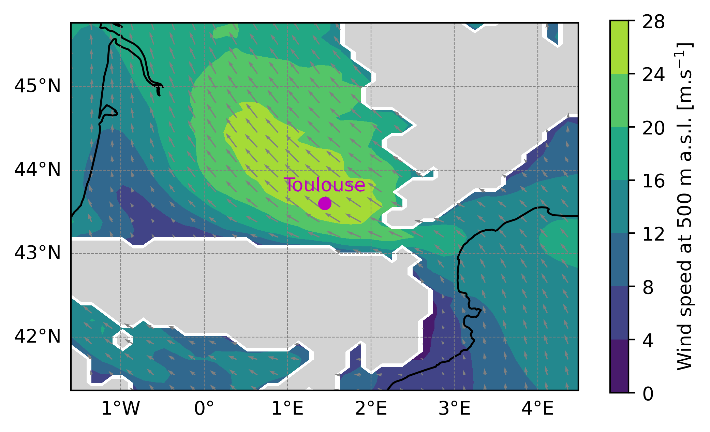

One domain initialized and forced by ERA5
==================================================================

To perform a 3D Meso-NH simulation with real initial and surface conditions you need to :ref:`prepare the physiographic data <prep_pgd_real_one_domain_era5>`, :ref:`prepare the initial and lateral boundary conditions <prep_real_case_one_domain_era5>` and :ref:`run the model <mesonh_one_domain_era5>` using the :ref:`prep_pgd`, :ref:`prep_real_case` and :ref:`mesonh` executables respectively. In this example you will also use the :ref:`diag` program to :ref:`calculate diagnostics after the simulation <diag_one_domain_era5>`. These steps are described in the following sections.

.. warning::

   This kind of simulation is parallelized and can be run with more than 1 core.

.. _prep_pgd_real_one_domain_era5:

Prepare the physiographic data (:ref:`prep_pgd`)
------------------------------------------------------------------

To create the physiographic file you have to use :ref:`prep_pgd` program. This program reads a file called :file:`PRE_PGD1.nam` defining the characteristics of the simulation.

.. tip::

   To see all the namelists you can use in the :ref:`prep_pgd` program or to obtain information about namelists, please go :ref:`here <executables_and_namelists>`.

In the :file:`PRE_PGD1.nam` file, we recommend to have the following minimum informations and namelists:

* The name of the NetCDF file you will create with the :ref:`prep_pgd` program (without the extension) in :ref:`NAM_PGDFILE <nam_pgdfile>` namelist:

  .. code:: fortran

     &NAM_PGDFILE CPGDFILE = "PGD" /

  .. note::

     In this example, you will create a NetCDF file :file:`PGD.nc` corresponding to surface boundary conditions files.

* The kind of desired projection you will use in :ref:`NAM_PGD_GRID <nam_pgd_grid>` namelist:

  .. code:: fortran

     &NAM_PGD_GRID CGRID = "CONF PROJ" /

  .. note::

     In this example, you will use conformal projection and you also need to define charastetics of this projection filling :ref:`NAM_CONF_PROJ <nam_conf_proj>` and :ref:`NAM_CONF_PROJ_GRID <nam_conf_proj_grid>` namelists.

* The characteristic of the conformal projection in :ref:`NAM_CONF_PROJ <nam_conf_proj>` namelist:

  .. code:: fortran
  
     &NAM_CONF_PROJ XLAT0 = 43.604,
                    XLON0 = 1.444,
                    XRPK  = 0.,
                    XBETA = 0. /

* The characteristic of the conformal projection grid in :ref:`NAM_CONF_PROJ_GRID <nam_conf_proj_grid>` namelist:

  .. code:: fortran
  
     &NAM_CONF_PROJ_GRID XLATCEN = 43.604,
                         XLONCEN = 1.444,
                         NIMAX   = 50,
                         NJMAX   = 50,
                         XDX     = 10000.,
                         XDY     = 10000. /

  .. note::

     In this example, you will use a grid of 50x50 horizontal grid points, with a horizontal resolution of 10 km and the domain will be centered in Toulouse (lon=43.604, lat=1.444).
     
* The kind of cover database you want to use in :ref:`NAM_COVER <nam_cover>` namelist:

  .. code:: fortran
  
     &NAM_COVER YCOVER         = "ECOCLIMAP_v2.0",
                YCOVERFILETYPE = "DIRECT" /

  .. note::

     In this example, you will use ECOCLIMAP_v2.0 database with more than 200 covers at 1 km horizontal resolution. Other database can be found `here <https://www.umr-cnrm.fr/surfex/spip.php?article136>`_.

* The kind of orography database you want to use in :ref:`NAM_ZS <nam_zs>` namelist:

  .. code:: fortran
  
     &NAM_ZS YZS         = "gtopo30",
             YZSFILETYPE = "DIRECT" /

  .. note::

     In this example, you will use gtopo30 database at approximately 1 km horizontal resolution. Other database can be found `here <https://www.umr-cnrm.fr/surfex/spip.php?article134>`_.

* The kind of clay and sand database you want to use in :ref:`NAM_ISBA <nam_isba>` namelist:

  .. code:: fortran
  
     &NAM_ISBA YCLAY         = "CLAY_HWSD_MOY",
               YCLAYFILETYPE = "DIRECT",
               YSAND         = "SAND_HWSD_MOY",
               YSANDFILETYPE = "DIRECT" /

  .. note::

     In this example, you will use CLAY_HWSD_MOY and  SAND_HWSD_MOY database at 1 km horizontal resolution. Other database can be found `here <https://www.umr-cnrm.fr/surfex/spip.php?article135>`_.

.. tip::

   See the full :file:`PRE_PGD1.nam` file:
   
   .. toggle::

      .. code-block:: fortran

         &NAM_PGDFILE CPGDFILE = "PGD" /
  
         &NAM_PGD_GRID CGRID = "CONF PROJ" /

         &NAM_CONF_PROJ XLAT0 = 43.604,
                        XLON0 = 1.444,
                        XRPK  = 0.,
                        XBETA = 0. /

         &NAM_CONF_PROJ_GRID XLATCEN = 43.604,
                             XLONCEN = 1.444,
                             NIMAX   = 50,
                             NJMAX   = 50,
                             XDX     = 10000.,
                             XDY     = 10000. /

         &NAM_COVER YCOVER         = "ECOCLIMAP_v2.0",
                    YCOVERFILETYPE = "DIRECT" /

         &NAM_ZS YZS         = "gtopo30",
                 YZSFILETYPE = "DIRECT" /

         &NAM_ISBA YCLAY         = "CLAY_HWSD_MOY",
                   YCLAYFILETYPE = "DIRECT",
                   YSAND         = "SAND_HWSD_MOY",
                   YSANDFILETYPE = "DIRECT" /

Once you have put these namelist in the :file:`PRE_PGD1.nam` file, you can launch :ref:`prep_pgd` program in the same directory as the :file:`PRE_PGD1.nam` file (execution takes approximately 4 s):

.. code-block:: bash
   :substitutions:

   source |MNH_directory_extract_current|/conf/profile_mesonh
   PREP_PGD${XYZ}

At the end of the :ref:`prep_pgd` execution, you need to have following files:

.. role:: gray
   :class: text-gray

.. treeview::

   - :dir:`folder` your_run_directory/

     - :dir:`file` PRE_PGD1.nam :gray:`: The file you've created from this example`
     - :dir:`file` PGD.nc :gray:`: The NetCDF part of the physiographic data file`
     - :dir:`file` OUTPUT_LISTING0 :gray:`: File containing debug informations`

.. tip::

   To verify that the program has been executed correctly, you should see the following lines at the end of the :file:`OUTPUT_LISTING0` file:

   .. code-block:: bash

      ***************************
      * PREP_PGD ends correctly *
      ***************************

.. _prep_real_case_one_domain_era5:

Prepare the initial and lateral boundary conditions (:ref:`prep_real_case`)
------------------------------------------------------------------

To create the initial and lateral boundary condition files for a real case Meso-NH simulation you have to use :ref:`prep_real_case` program. This program reads a file called :file:`PRE_REAL1.nam` defining the characteristics of the simulation.

.. tip::

   To see all the namelists you can use in the :ref:`prep_real_case` program or to obtain information about namelists, please go :ref:`here <executables_and_namelists>`.

.. note::

   Before using :ref:`prep_real_case` program to create initial and lateral boundary condition files for Meso-NH, you need to extract three dimensional :ref:`atmospheric_data`. In this example, you have to :ref:`extract ERA5 data <get_ERA5_data>`. At the end of the extraction you need to have the two grib files :file:`era5.20251113.18` and :file:`era5.20251113.18`.
   
In the :file:`PRE_REAL1.nam` file, we recommend to have the following minimum informations and namelists:

* The information about PGD file created in previous section in :ref:`NAM_FILE_NAMES <nam_file_names>` namelist:

  .. code:: fortran
  
     &NAM_FILE_NAMES HPGDFILE     = "PGD",
                     HATMFILE     = "era5.YEARMONTHDAY.HOUR",
                     HATMFILETYPE = "GRIBEX",
                     CINIFILE     = "ERA5.YEARMONTHDAY.HOUR" /

  .. note::

     * You will physiographic data file created in the :ref:`previous step <prep_pgd_real_one_domain_era5>`.
     
     * You need to run :ref:`prep_real_case` program twice, replacing YEARMONTHDAY.HOUR with the correct dates of the grib files (20251113.18 and 20251113.19). The first file created with :ref:`prep_real_case` program (:code:`CINIFILE`) will correspond to the initial condition and the second to the lateral boundary condition.

* The vertical grid discretisation in :ref:`NAM_VER_GRID <nam_ver_grid>` namelist:

  .. code:: fortran

     &NAM_VER_GRID NKMAX        = 30,
                   YZGRID_TYPE  = "FUNCTN",
                   ZDZGRD       = 100.,
                   ZDZTOP       = 3000.,
                   ZZMAX_STRGRD = 1500.,
                   ZSTRGRD      = 10.,
                   ZSTRTOP      = 15. /

  .. note::

     In this example, you will use 30 vertical grid points with a vertical resolution of 100 m close to the ground and a stretching until the top of the domain with a maximum grid spacing of 3000 m.

.. tip::

   See the full :file:`PRE_REAL1.nam` file:
   
   .. toggle::

      .. code-block:: fortran

         &NAM_FILE_NAMES HPGDFILE     = "PGD",
                         HATMFILE     = "era5.YEARMONTHDAY.HOUR",
                         HATMFILETYPE = "GRIBEX",
                         CINIFILE     = "ERA5.YEARMONTHDAY.HOUR" /

         &NAM_VER_GRID NKMAX        = 30,
                       YZGRID_TYPE  = "FUNCTN",
                       ZDZGRD       = 100.,
                       ZDZTOP       = 3000.,
                       ZZMAX_STRGRD = 1500.,
                       ZSTRGRD      = 10.,
                       ZSTRTOP      = 15. /

Once you have put these namelist in the :file:`PRE_REAL1.nam` file, you can launch :ref:`prep_real_case` program in the same directory as the :file:`PRE_REAL1.nam` file (execution takes less than 4 s):

.. code-block:: bash
   :substitutions:

   source |MNH_directory_extract_current|/conf/profile_mesonh
   PREP_REAL_CASE${XYZ}

At the end of the :ref:`prep_ideal_case` execution, you need to have following files:

.. role:: gray
   :class: text-gray

.. treeview::

   - :dir:`folder` your_run_directory/

     - :dir:`file` PRE_REAL1.nam :gray:`: The file you've created from this example`
     - :dir:`file` ERA5.20251113.18.des :gray:`: The descriptive part of the initial condition file`
     - :dir:`file` ERA5.20251113.18.nc :gray:`: The NetCDF part of the initial condition file`
     - :dir:`file` ERA5.20251113.19.des :gray:`: The descriptive part of the lateral boundary condition file`
     - :dir:`file` ERA5.20251113.19.nc :gray:`: The NetCDF part of the lateral boundary condition file`     
     - :dir:`file` PGD.nc :gray:`: The NetCDF part of the physiographic data file`
     - :dir:`file` OUTPUT_LISTING0 :gray:`: File containing debug informations`

.. tip::

   To verify that the program has been executed correctly, you should see the following lines at the end of the :file:`OUTPUT_LISTING1` file:

   .. code-block:: bash

      ****************************************************
      * PREP_REAL_CASE: PREP_REAL_CASE ENDS CORRECTLY. *
      ****************************************************

.. _mesonh_one_domain_era5:

Launch the simulation (:ref:`mesonh`)
-----------------------------------------------------------------

To launch the Meso-NH simulation you have to use :ref:`mesonh` program. This program reads a file called :file:`EXSEG1.nam` defining the characteristics of the simulation.

.. tip::

   To see all the namelists you can use in the :ref:`mesonh` program or to obtain information about namelists, please go :ref:`here <executables_and_namelists>`.

In the :file:`EXSEG1.nam` file, we recommend to have the following minimum informations and namelists:

* The name of the NetCDF files created by the :ref:`prep_pgd` and :ref:`prep_real_case` program in :ref:`NAM_LUNITn <nam_lunitn>` namelist:

  .. code:: fortran

     &NAM_LUNITn CINIFILE    = "ERA5.20251113.18",
                 CINIFILEPGD = "PGD",
                 CCPLFILE(1) = "ERA5.20251113.19" /

* The name of the experiment and segment and the configuration of the simulation in :ref:`NAM_CONF <nam_conf>` namelist:

  .. code:: fortran

     &NAM_CONF CCONF   = "START",
               CEXP    = "EXP01",
               CSEG    = "SEG01" /
               
  .. note:
  
     * In this example, you will do a START from ERA5 data directly. Other possibility is to do a RESTArt from a previous segment.
     
     * Simulation file names will be of the type :file:`CEXP.1.CSEG.XXX.nc`.

* The simulated length (in s), the top absorbing layer coefficient and the activation of numerical diffusion in :ref:`NAM_DYN <nam_dyn>` namelist :

  .. code:: fortran

     &NAM_DYN XSEGLEN  = 600.,
              LNUMDIFU = .TRUE.,
              XALKTOP  = 0.01,
              XALZBOT  = 14000. /

  .. note::

     * To activate the top absorbing layer you have to put :code:`LVE_RELAX = .TRUE.` in :ref:`NAM_DYNn <nam_dynn>` namelist.
     
     * The coefficient for numerical diffusion has to be defined in :ref:`NAM_DYNn <nam_dynn>` namelist.

* The backup output writing period in :ref:`NAM_BACKUP <nam_backup>` namelist:

  .. code:: fortran

     &NAM_BACKUP XBAK_TIME(1,1) = 600.0 /

* The time step, pressure solver option and the activation of the top absorbing layer in :ref:`NAM_DYNn <nam_dynn>` namelist:

  .. code:: fortran

     &NAM_DYNn XTSTEP         = 10.,
               CPRESOPT       = "CRESI",
               LHORELAX_UVWTH = .TRUE.,
               LHORELAX_RV    = .TRUE.,
               LVE_RELAX      = .TRUE.,
               NRIMX          = 5,
               NRIMY          = 5,
               XT4DIFU        = 1800. /

* The temporal and advection schemes in :ref:`NAM_ADVn <nam_advn>` namelist:

  .. code:: fortran

     &NAM_ADVn CTEMP_SCHEME    = "RKC4",
               CUVW_ADV_SCHEME = "CEN4TH",
               CMET_ADV_SCHEME = "PPM_01" /
  
* The lateral boundary condition options :ref:`NAM_LBCn <nam_lbcn>` namelist:

  .. code:: fortran
  
     &NAM_LBCn CLBCX = 2*"OPEN",
               CLBCY = 2*"OPEN" /

  .. note::

     In this example you will use open boundary condition in i and j directions.

* The physical parametrization options in :ref:`NAM_PARAMn <nam_paramn>` namelist:

  .. code:: fortran

     &NAM_PARAMn CTURB  = "TKEL",
                 CRAD   = "ECMW",
                 CCLOUD = "ICE3",
                 CSCONV = "EDKF",
                 CDCONV = "NONE" /

  .. note::

     In this example, you will use turbulence, radiative, miscrophysics and shallow convection parametrizations.

* The radiative parametrization options in :ref:`NAM_PARAM_RADn <nam_param_radn>` namelist:

  .. code:: fortran
  
     &NAM_PARAM_RADn XDTRAD        = 300.,
                     XDTRAD_CLONLY = 300. /

* The convective parametrization options in :ref:`NAM_PARAM_KAFRn <nam_param_kafrn>` namelist:

  .. code:: fortran
  
     &NAM_PARAM_KAFRn XDTCONV = 300. /

* The turbulent parametrization options in :ref:`NAM_TURBn <nam_turbn>` namelist:

  .. code:: fortran
  
     &NAM_TURBn CTURBLEN = "BL89",
                CTURBDIM = "1DIM" /

.. tip::

   See the full :file:`EXSEG1.nam` file:
   
   .. toggle::

      .. code-block:: fortran

         &NAM_LUNITn CINIFILE    = "ERA5.20251113.18",
                     CINIFILEPGD = "PGD",
                     CCPLFILE(1) = "ERA5.20251113.19" /

         &NAM_CONF CCONF   = "START",
                   CEXP    = "EXP01",
                   CSEG    = "SEG01" /

         &NAM_DYN XSEGLEN  = 600.,
                  LNUMDIFU = .TRUE.,
                  XALKTOP  = 0.01,
                  XALZBOT  = 14000. /

         &NAM_BACKUP XBAK_TIME(1,1) = 600. /

         &NAM_DYNn XTSTEP         = 10.,
                   CPRESOPT       = "CRESI",
                   LHORELAX_UVWTH = .TRUE.,
                   LHORELAX_RV    = .TRUE.,
                   LVE_RELAX      = .TRUE.,
                   NRIMX          = 5,
                   NRIMY          = 5,
                   XT4DIFU        = 1800. /

         &NAM_ADVn CTEMP_SCHEME    = "RKC4",
                   CUVW_ADV_SCHEME = "CEN4TH",
                   CMET_ADV_SCHEME = "PPM_01" /

         &NAM_LBCn CLBCX = 2*"OPEN",
                   CLBCY = 2*"OPEN" /

         &NAM_PARAMn CTURB  = "TKEL",
                     CRAD   = "ECMW",
                     CCLOUD = "ICE3",
                     CSCONV = "EDKF",
                     CDCONV = "KAFR" /

         &NAM_PARAM_RADn XDTRAD        = 300.,
                         XDTRAD_CLONLY = 300. /

         &NAM_PARAM_KAFRn XDTCONV = 300. /

         &NAM_TURBn CTURBLEN = "BL89",
                    CTURBDIM = "1DIM" /

Once you have put these namelist in the :file:`EXSEG1.nam` file, you can launch :ref:`mesonh` program in the same directory as the :file:`EXSEG1.nam`, :file:`ERA5.20251113.18.des`, :file:`ERA5.20251113.18.nc`, :file:`ERA5.20251113.19.des`, :file:`ERA5.20251113.19.nc` and :file:`PGD.nc` files (execution takes less than 50 s on 2 cores):

.. code-block:: bash
   :substitutions:

   source |MNH_directory_extract_current|/conf/profile_mesonh
   mpirun -np 2 MESONH${XYZ}

At the end of the :ref:`mesonh` execution, you need to have following files:

.. role:: gray
   :class: text-gray

.. treeview::

   - :dir:`folder` your_run_directory/

     - :dir:`file` PGD.nc :gray:`: The NetCDF part of the physiographic data file`
     - :dir:`file` ERA5.20251113.18.des :gray:`: The descriptive part of the initial condition file`
     - :dir:`file` ERA5.20251113.18.nc :gray:`: The NetCDF part of the initial condition file`
     - :dir:`file` ERA5.20251113.19.des :gray:`: The descriptive part of the lateral boundary condition file`
     - :dir:`file` ERA5.20251113.19.nc :gray:`: The NetCDF part of the lateral boundar condition file`     
     - :dir:`file` EXSEG1.nam :gray:`: The file you've created from this example`
     - :dir:`file` EXP01.1.SEG01.000.des :gray:`: The descriptive part of the simulated output file`
     - :dir:`file` EXP01.1.SEG01.000.nc :gray:`: The NetCDF part of the simulated output file`
     - :dir:`file` EXP01.1.SEG01.001.des :gray:`: The descriptive part of the simulated output file`
     - :dir:`file` EXP01.1.SEG01.001.nc :gray:`: The NetCDF part of the simulated output file`
     - :dir:`file` OUTPUT_LISTING0 :gray:`: File containing debug informations`
     - :dir:`file` OUTPUT_LISTING1 :gray:`: File containing debug informations`

.. tip::

   * The *.001.nc file contains :ref:`NAM_BACKUP <nam_backup>` output. This file can be used to restart the simulation. It contains one time variables.

   * To verify that the program has been executed correctly, you should see the following lines at the end of the :file:`OUTPUT_LISTING1` file:

     .. code-block:: bash

        |++++++++++++++++++++++++++++++++++++++++++++++++++++++++++++++++++++++++++++++++++++++++++++++++++++|
        | MODEL1                      | CPUTIME ||         87.282|    43.641|    43.607|    43.675|   100.000|
        | MODEL1                      | ELAPSED ||         87.481|    43.740|    43.740|    43.741|   100.000|
        |++++++++++++++++++++++++++++++++++++++++++++++++++++++++++++++++++++++++++++++++++++++++++++++++++++|
        |++++++++++++++++++++++++++++++++++++++++++++++++++++++++++++++++++++++++++++++++++++++++++++++++++++|
        |++++++++++++++++++++++++++++++++++++++++++++++++++++++++++++++++++++++++++++++++++++++++++++++++++++|
        |====================================================================================================|
        | SECOND/STEP=61              | CPUTIME ||          1.431|     0.715|     0.715|     0.716|     1.639|
        | SECOND/STEP=61              | ELAPSED ||          1.434|     0.717|     0.717|     0.717|     1.639|
        |----------------------------------------------------------------------------------------------------|
        | MICROSEC/STP/PT=75000       | CPUTIME ||         19.078|     9.539|     9.531|     9.546|   100.000|
        | MICROSEC/STP/PT=75000       | ELAPSED ||         19.122|     9.561|     9.561|     9.561|   100.000|
        |====================================================================================================|

.. _diag_one_domain_era5:

Compute diagnostics after the simulation (:ref:`diag`)
-----------------------------------------------------------------

To compute diagnostics after a Meso-NH simulation you have to use :ref:`diag` program. This program reads a file called :file:`DIAG1.nam` defining the characteristics of the diagnostics you want.

.. tip::

   To see all the namelists you can use in the :ref:`diag` program or to obtain information about namelists, please go :ref:`here <executables_and_namelists>`.

In the :file:`DIAG1.nam` file, we recommend to have the following minimum informations and namelists:

* The name of input NetCDF files and the extension of the one created by the :ref:`diag` program in :ref:`NAM_DIAG_FILE <nam_diag_file>` namelist:

  .. code:: fortran

     &NAM_DIAG_FILE YINIFILE(1)    = "EXP01.1.SEG01.001",
                    YINIFILEPGD(1) = "PGD",
                    YSUFFIX        = "diag" /
                    
  .. note::

     * In this example, you will create a file called :file:`EXP01.1.SEG01.001diag.nc`.

* The type of diag you want to perform in :ref:`NAM_DIAG <nam_diag>` namelist :

  .. code:: fortran

     &NAM_DIAG LISOAL    = .TRUE.,
               XISOAL(1) = 3000.0 /

  .. note::

     * In this example, you will interpole some variables at a constant altitude of 500 m above sea level.

.. tip::

   See the full :file:`DIAG1.nam` file:
   
   .. toggle::

      .. code-block:: fortran

         &NAM_DIAG_FILE YINIFILE(1)    = "EXP01.1.SEG01.001",
                        YINIFILEPGD(1) = "PGD",
                        YSUFFIX        = "diag" /

         &NAM_DIAG LISOAL    = .TRUE.,
                   XISOAL(1) = 500.0 /

Once you have put these namelist in the :file:`DIAG1.nam` file, you can launch :ref:`diag` program in the same directory as the :file:`DIAG1.nam`, :file:`EXP01.1.SEG01.001.des`, :file:`EXP01.1.SEG01.001.nc` and :file:`PGD.nc` files (execution takes approximately 2 seconds):

.. code-block:: bash
   :substitutions:

   source |MNH_directory_extract_current|/conf/profile_mesonh
   DIAG${XYZ}

At the end of the :ref:`diag` execution, you need to have following files:

.. role:: gray
   :class: text-gray

.. treeview::

   - :dir:`folder` your_run_directory/

     - :dir:`file` PGD.nc :gray:`: The NetCDF part of the physiographic data file`
     - :dir:`file` DIAG1.nam :gray:`: The file you've created from this example`
     - :dir:`file` EXP01.1.SEG01.001.des :gray:`: The descriptive part of the simulated output file`
     - :dir:`file` EXP01.1.SEG01.001.nc :gray:`: The NetCDF part of the simulated output file`
     - :dir:`file` EXP01.1.SEG01.001diag.nc :gray:`: The NetCDF part of the diagnostic output file`     
     - :dir:`file` OUTPUT_LISTING0 :gray:`: File containing debug informations`
     - :dir:`file` OUTPUT_LISTING1 :gray:`: File containing debug informations`

.. tip::

   To verify that the program has been executed correctly, you should see the following lines at the end of the :file:`OUTPUT_LISTING0` file:

   .. code-block:: bash

      ***************************** **************
      *            EXIT  DIAG CORRECTLY          *
      **************************** ***************

Plot results
-----------------------------------------------------------------

The following figure shows an example of a graph that you can plot from the simulation you just performed. It shows a classic episode of the Autan wind. Gray areas correspond to mountain higher than 500 m.

   Example of real case simulation output. Horizontal wind speed at 500 m a.s.l.

.. tip::

   See the python script used to plot this figure:

   .. toggle::
     
      .. code-block:: python

         #!/usr/bin/python
         # -*- coding: utf-8 -*-

         # ~~~~~~~~~~~~~~~~~~~~~~~~~~~~~~~~~~~~~~~~~~~~~~~~~~~~~~~~~
         import numpy as np
         import netCDF4
         import matplotlib.pyplot as plt
         import cartopy.crs as ccrs
         # ~~~~~~~~~~~~~~~~~~~~~~~~~~~~~~~~~~~~~~~~~~~~~~~~~~~~~~~~~

         # #########################################################
         # ###           To be defined by user                   ###
         # #########################################################

         cfg_file_name = 'EXP01.1.SEG01.001diag.nc'

         # #########################################################

         # ------------------------------------------------------
         #   Read netcdf file and variables
         # ------------------------------------------------------

         file_MNH     = netCDF4.Dataset(cfg_file_name)

         lon_MNH     = file_MNH['LON'][1:-1,1:-1]
         lat_MNH     = file_MNH['LAT'][1:-1,1:-1]

         zs_MNH       = file_MNH['ZS'][1:-1,1:-1]
         uwnd_MNH     = file_MNH['ALT_U'][0,0,1:-1,1:-1]
         vwnd_MNH     = file_MNH['ALT_V'][0,0,1:-1,1:-1]

         mask_MNH        = uwnd_MNH < -1000.0
         uwnd_MNH_masked = np.ma.masked_where(mask_MNH, uwnd_MNH)
         vwnd_MNH_masked = np.ma.masked_where(mask_MNH, vwnd_MNH)

         wnd_MNH_masked = np.sqrt(uwnd_MNH_masked**2.0+vwnd_MNH_masked**2.0)

         # ------------------------------------------------------
         #   Quick plot
         # ------------------------------------------------------

         fig = plt.figure(figsize=(6, 6))
         ax  = plt.axes(projection=ccrs.PlateCarree())

         pmsh = ax.contourf(lon_MNH[:,:], lat_MNH[:,:], wnd_MNH_masked[:,:], vmin=0.0, vmax=30.0, shading="auto", cmap="viridis")
         ctf  = ax.contourf(lon_MNH[:,:], lat_MNH[:,:], mask_MNH[:,:], levels=[0.5, 1], colors='lightgray')
         qvr  = ax.quiver  (lon_MNH[::2,::2], lat_MNH[::2,::2], uwnd_MNH_masked[::2, ::2], vwnd_MNH_masked[::2, ::2], color="gray")

         # ------------------------------------------------------
         #   Some adjustments to the plot
         # ------------------------------------------------------
         gl = ax.gridlines(draw_labels=True, linewidth=0.4, color='gray', linestyle='--')
         gl.top_labels = False
         gl.right_labels = False

         ax.coastlines()

         cbar =plt.colorbar(pmsh,shrink=0.59)
         cbar.set_label(r"Wind speed at 500 m a.s.l. [m.s$^{-1}$]")

         ax.plot(1.444, 43.604, marker='o', color='m', markersize=6)
         ax.text(1.444, 43.604+0.1, "Toulouse", color='m', fontsize=10, ha='center', va='bottom')

         plt.savefig('one_domain_era5.png', bbox_inches='tight', dpi=400)
         
Other examples
-----------------------------------------------------------------

You can find real case simulation examples in :ref:`cases_catalogue` section.
