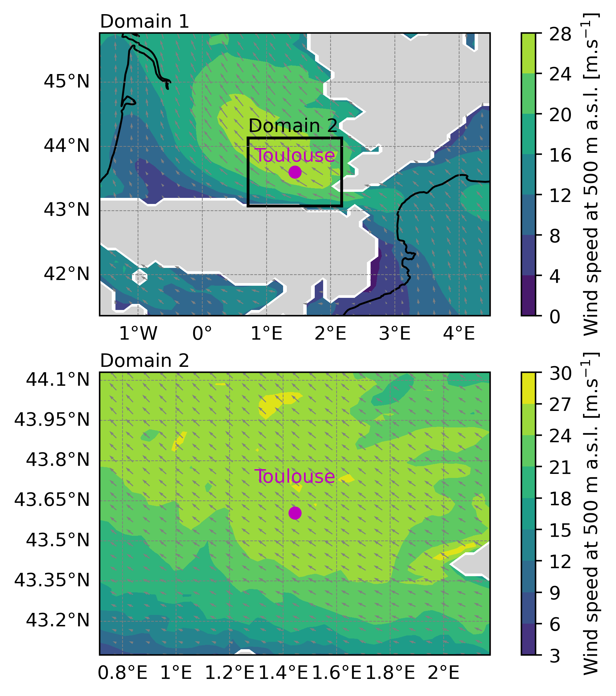

Grid-nesting with 2 domains initialized and forced by ERA5
==================================================================

To perform a 3D Meso-NH simulation with real initial and surface conditions and two grid nested domains, you need to :ref:`prepare the physiographic data <prep_pgd_d1_two_domains_era5>` for both domains, :ref:`prepare the initial and lateral boundary conditions <prep_real_case_d1_two_domains_era5>` and :ref:`run the model <mesonh_two_domains_era5>` using the :ref:`prep_pgd`, :ref:`prep_nest_pgd`, :ref:`prep_real_case`, :ref:`spawning` and :ref:`mesonh` executables respectively. In this example you will also use the :ref:`diag` program to :ref:`calculate diagnostics after the simulation <diag_two_domains_era5>`. These steps are described in the following sections:

.. contents::
   :local:
   :depth: 1
   :backlinks: top

.. warning::

   This kind of simulation is parallelized and can be run with more than 1 core.

.. _prep_pgd_d1_two_domains_era5:

Prepare the physiographic data for domain 1 (:ref:`prep_pgd`)
------------------------------------------------------------------

To create the physiographic file for domain 1 you have to use :ref:`prep_pgd` program. This program reads a file called :file:`PRE_PGD1.nam` defining the characteristics of the simulation.

.. tip::

   To see all the namelists you can use in the :ref:`prep_pgd` program or to obtain information about namelists, please go :ref:`here <executables_and_namelists>`.

In the :file:`PRE_PGD1.nam` file, we recommend to have the following minimum informations and namelists:

* The name of the NetCDF file you will create with the :ref:`prep_pgd` program (without the extension) in :ref:`NAM_PGDFILE <nam_pgdfile>` namelist:

  .. code:: fortran

     &NAM_PGDFILE CPGDFILE = "PGD_D1" /

  .. note::

     In this example, you will create a NetCDF file :file:`PGD_D1.nc` corresponding to surface boundary conditions files.

* The kind of desired projection you will use in :ref:`NAM_PGD_GRID <nam_pgd_grid>` namelist:

  .. code:: fortran

     &NAM_PGD_GRID CGRID = "CONF PROJ" /

  .. note::

     In this example, you will use conformal projection and you also need to define charastetics of this projection filling :ref:`NAM_CONF_PROJ <nam_conf_proj>` and :ref:`NAM_CONF_PROJ_GRID <nam_conf_proj_grid>` namelists.

* The characteristic of the conformal projection in :ref:`NAM_CONF_PROJ <nam_conf_proj>` namelist:

  .. code:: fortran
  
     &NAM_CONF_PROJ XLAT0 = 43.604,
                    XLON0 = 1.444,
                    XRPK  = 0.,
                    XBETA = 0. /

* The characteristic of the conformal projection grid in :ref:`NAM_CONF_PROJ_GRID <nam_conf_proj_grid>` namelist:

  .. code:: fortran
  
     &NAM_CONF_PROJ_GRID XLATCEN = 43.604,
                         XLONCEN = 1.444,
                         NIMAX   = 50,
                         NJMAX   = 50,
                         XDX     = 10000.,
                         XDY     = 10000. /

  .. note::

     In this example, you will use a grid of 50x50 horizontal grid points, with a horizontal resolution of 10 km and the domain will be centered in Toulouse (lon=43.604, lat=1.444).
     
* The kind of cover database you want to use in :ref:`NAM_COVER <nam_cover>` namelist:

  .. code:: fortran
  
     &NAM_COVER YCOVER         = "ECOCLIMAP_v2.0",
                YCOVERFILETYPE = "DIRECT" /

  .. note::

     In this example, you will use ECOCLIMAP_v2.0 database with more than 200 covers at 1 km horizontal resolution. Other database can be found `here <https://www.umr-cnrm.fr/surfex/spip.php?article136>`_.

* The kind of orography database you want to use in :ref:`NAM_ZS <nam_zs>` namelist:

  .. code:: fortran
  
     &NAM_ZS YZS         = "gtopo30",
             YZSFILETYPE = "DIRECT" /

  .. note::

     In this example, you will use gtopo30 database at approximately 1 km horizontal resolution. Other database can be found `here <https://www.umr-cnrm.fr/surfex/spip.php?article134>`_.

* The kind of clay and sand database you want to use in :ref:`NAM_ISBA <nam_isba>` namelist:

  .. code:: fortran
  
     &NAM_ISBA YCLAY         = "CLAY_HWSD_MOY",
               YCLAYFILETYPE = "DIRECT",
               YSAND         = "SAND_HWSD_MOY",
               YSANDFILETYPE = "DIRECT" /

  .. note::

     In this example, you will use CLAY_HWSD_MOY and  SAND_HWSD_MOY database at 1 km horizontal resolution. Other database can be found `here <https://www.umr-cnrm.fr/surfex/spip.php?article135>`_.

.. tip::

   See the full :file:`PRE_PGD1.nam` file:
   
   .. toggle::

      .. code-block:: fortran

         &NAM_PGDFILE CPGDFILE = "PGD" /
  
         &NAM_PGD_GRID CGRID = "CONF PROJ" /

         &NAM_CONF_PROJ XLAT0 = 43.604,
                        XLON0 = 1.444,
                        XRPK  = 0.,
                        XBETA = 0. /

         &NAM_CONF_PROJ_GRID XLATCEN = 43.604,
                             XLONCEN = 1.444,
                             NIMAX   = 50,
                             NJMAX   = 50,
                             XDX     = 10000.,
                             XDY     = 10000. /

         &NAM_COVER YCOVER         = "ECOCLIMAP_v2.0",
                    YCOVERFILETYPE = "DIRECT" /

         &NAM_ZS YZS         = "gtopo30",
                 YZSFILETYPE = "DIRECT" /

         &NAM_ISBA YCLAY         = "CLAY_HWSD_MOY",
                   YCLAYFILETYPE = "DIRECT",
                   YSAND         = "SAND_HWSD_MOY",
                   YSANDFILETYPE = "DIRECT" /

Once you have put these namelist in the :file:`PRE_PGD1.nam` file, you can launch :ref:`prep_pgd` program in the same directory as the :file:`PRE_PGD1.nam` file (execution takes approximately 4 s):

.. code-block:: bash
   :substitutions:

   source |MNH_directory_extract_current|/conf/profile_mesonh
   PREP_PGD${XYZ}

At the end of the :ref:`prep_pgd` execution, you need to have following files:

.. role:: gray
   :class: text-gray

.. treeview::

   - :dir:`folder` your_run_directory/

     - :dir:`file` PRE_PGD1.nam :gray:`: The file you've created from this example`
     - :dir:`file` PGD_D1.nc :gray:`: The NetCDF part of the physiographic data file`
     - :dir:`file` OUTPUT_LISTING0 :gray:`: File containing debug informations`

.. tip::

   To verify that the program has been executed correctly, you should see the following lines at the end of the :file:`OUTPUT_LISTING0` file:

   .. code-block:: bash

      ***************************
      * PREP_PGD ends correctly *
      ***************************

.. _prep_pgd_d2_two_domains_era5:

Prepare the physiographic data for domain 2 (:ref:`prep_pgd`)
------------------------------------------------------------------

To create the physiographic file for domain 2 you have to use :ref:`prep_pgd` program. This program reads a file called :file:`PRE_PGD1.nam` defining the characteristics of the simulation.

.. tip::

   To see all the namelists you can use in the :ref:`prep_pgd` program or to obtain information about namelists, please go :ref:`here <executables_and_namelists>`.

In the :file:`PRE_PGD1.nam` file, we recommend to have the following minimum informations and namelists:

* The name of the NetCDF file you will create with the :ref:`prep_pgd` program (without the extension) in :ref:`NAM_PGDFILE <nam_pgdfile>` namelist:

  .. code:: fortran

     &NAM_PGDFILE CPGDFILE = "PGD_D2" /

  .. note::

     In this example, you will create a NetCDF file :file:`PGD_D2.nc` corresponding to surface boundary conditions files.

* The kind of desired projection you will use in :ref:`NAM_PGD_GRID <nam_pgd_grid>` namelist:

  .. code:: fortran

     &NAM_PGD_GRID YINIFILE     = "PGD_D1",
                   YINIFILETYPE = "MESONH" /

  .. note::

     In this example, you will create the domain 2 from the domain 1.

* The position of the domain 2 inside the domain 1 in :ref:`NAM_INIFILE_CONF_PROJ <nam_inifile_conf_proj>` namelist:

  .. code:: fortran
  
     &NAM_INIFILE_CONF_PROJ IXOR     = 20,
                            IYOR     = 20,
                            IXSIZE   = 12,
                            IYSIZE   = 12,
                            IDXRATIO = 4,
                            IDYRATIO = 4 /
                            
  .. note::

     In this example, domain 2 will have 48x48 horizontal grid points and the bottom left corner of the domain is located at the 20,20 domain 1 grid point.
     
* The kind of cover database you want to use in :ref:`NAM_COVER <nam_cover>` namelist:

  .. code:: fortran
  
     &NAM_COVER YCOVER         = "ECOCLIMAP_v2.0",
                YCOVERFILETYPE = "DIRECT" /

  .. note::

     In this example, you will use ECOCLIMAP_v2.0 database with more than 200 covers at 1 km horizontal resolution. Other database can be found `here <https://www.umr-cnrm.fr/surfex/spip.php?article136>`_.

* The kind of orography database you want to use in :ref:`NAM_ZS <nam_zs>` namelist:

  .. code:: fortran
  
     &NAM_ZS YZS         = "gtopo30",
             YZSFILETYPE = "DIRECT" /

  .. note::

     In this example, you will use gtopo30 database at approximately 1 km horizontal resolution. Other database can be found `here <https://www.umr-cnrm.fr/surfex/spip.php?article134>`_.

* The kind of clay and sand database you want to use in :ref:`NAM_ISBA <nam_isba>` namelist:

  .. code:: fortran
  
     &NAM_ISBA YCLAY         = "CLAY_HWSD_MOY",
               YCLAYFILETYPE = "DIRECT",
               YSAND         = "SAND_HWSD_MOY",
               YSANDFILETYPE = "DIRECT" /

  .. note::

     In this example, you will use CLAY_HWSD_MOY and  SAND_HWSD_MOY database at 1 km horizontal resolution. Other database can be found `here <https://www.umr-cnrm.fr/surfex/spip.php?article135>`_.

.. tip::

   See the full :file:`PRE_PGD1.nam` file:
   
   .. toggle::

      .. code-block:: fortran

         &NAM_PGD_GRID YINIFILE     = "PGD_D1",
                       YINIFILETYPE = "MESONH" /

         &NAM_PGDFILE CPGDFILE = "PGD_D2" /

         &NAM_INIFILE_CONF_PROJ IXOR     = 20,
                                IYOR     = 20,
                                IXSIZE   = 12,
                                IYSIZE   = 12,
                                IDXRATIO = 4,
                                IDYRATIO = 4 /

          &NAM_COVER YCOVER         = "ECOCLIMAP_v2.0",
                     YCOVERFILETYPE = "DIRECT" /

          &NAM_ZS YZS         = "gtopo30",
                  YZSFILETYPE = "DIRECT" /

          &NAM_ISBA YCLAY         = "CLAY_HWSD_MOY",
                    YCLAYFILETYPE = "DIRECT",
                    YSAND         = "SAND_HWSD_MOY",
                    YSANDFILETYPE = "DIRECT" /

Once you have put these namelist in the :file:`PRE_PGD1.nam` file, you can launch :ref:`prep_pgd` program in the same directory as the :file:`PGD_D1.nc` and :file:`PRE_PGD1.nam` file (execution takes approximately 4 s):

.. code-block:: bash
   :substitutions:

   source |MNH_directory_extract_current|/conf/profile_mesonh
   PREP_PGD${XYZ}

At the end of the :ref:`prep_pgd` execution, you need to have following files:

.. role:: gray
   :class: text-gray

.. treeview::

   - :dir:`folder` your_run_directory/

     - :dir:`file` PRE_PGD1.nam :gray:`: The file you've created from this example`
     - :dir:`file` PGD_D1.nc :gray:`: The NetCDF part of the physiographic data file for domain 1`     
     - :dir:`file` PGD_D2.nc :gray:`: The NetCDF part of the physiographic data file for domain 2`
     - :dir:`file` OUTPUT_LISTING0 :gray:`: File containing debug informations`

.. tip::

   To verify that the program has been executed correctly, you should see the following lines at the end of the :file:`OUTPUT_LISTING0` file:

   .. code-block:: bash

      ***************************
      * PREP_PGD ends correctly *
      ***************************

.. _prep_nest_pgd_d1_and_d2_two_domains_era5:

Make domains consistent (:ref:`prep_nest_pgd`)
------------------------------------------------------------------

To make domains consistents, you have to use :ref:`prep_nest_pgd` program. This program reads a file called :file:`PRE_NEST_PGD1.nam` defining the characteristics of the simulation.

.. tip::

   To see all the namelists you can use in the :ref:`prep_nest_pgd` program or to obtain information about namelists, please go :ref:`here <executables_and_namelists>`.

In the :file:`PRE_NEST_PGD1.nam` file, we recommend to have the following minimum informations and namelists:

* The name of the domain 1 in :ref:`NAM_PGD1 <nam_pgd1>` namelist:

  .. code:: fortran

     &NAM_PGD1 YPGD1 = "PGD_D1" /

* The name of the domain 2 and its relation with domain 1 in :ref:`NAM_PGD2 <nam_pgd2>` namelist:

  .. code:: fortran

     &NAM_PGD2 YPGD2 = "PGD_D2", IDAD = 1 /

* The name of the file you will create in :ref:`NAM_NEST_PGD <nam_nest_pgd>` namelist:

  .. code:: fortran
  
     &NAM_NEST_PGD YNEST="" /

  .. note::
  
     In this example, files created with :program:`prep_nest_pgd` will have the name :file:`PGD_D1.nest.nc` and :file:`PGD_D2.nest.nc`.
     
.. tip::

   See the full :file:`PRE_NEST_PGD1.nam` file:
   
   .. toggle::

      .. code-block:: fortran

         &NAM_PGD1 YPGD1 = "PGD_D1" /
  
         &NAM_PGD2 YPGD2 = "PGD_D2", IDAD = 1 /

         &NAM_NEST_PGD YNEST="" /

Once you have put these namelist in the :file:`PRE_NEST_PGD1.nam` file, you can launch :ref:`prep_nest_pgd` program in the same directory as the :file:`PRE_NEST_PGD1.nam` file (execution takes approximately 4 s):

.. code-block:: bash
   :substitutions:

   source |MNH_directory_extract_current|/conf/profile_mesonh
   PREP_NEST_PGD${XYZ}

At the end of the :ref:`prep_nest_pgd` execution, you need to have following files:

.. role:: gray
   :class: text-gray

.. treeview::

   - :dir:`folder` your_run_directory/

     - :dir:`file` PRE_NEST_PGD1.nam :gray:`: The file you've created from this example`
     - :dir:`file` PGD_D1.nc :gray:`: The NetCDF part of the physiographic data file of domain 1`
     - :dir:`file` PGD_D2.nc :gray:`: The NetCDF part of the physiographic data file of domain 2`
     - :dir:`file` PGD_D1.nest.nc :gray:`: The NetCDF part of the physiographic data file of domain 1, consitent with domain 2`
     - :dir:`file` PGD_D2.nest.nc :gray:`: The NetCDF part of the physiographic data file of domain 2, consitent with domain 1`               
     - :dir:`file` OUTPUT_LISTING0 :gray:`: File containing debug informations`
     - :dir:`file` OUTPUT_LISTING1 :gray:`: File containing debug informations`
     - :dir:`file` OUTPUT_LISTING2 :gray:`: File containing debug informations`          

.. tip::

   To verify that the program has been executed correctly, you should see the following lines at the end of the :file:`OUTPUT_LISTING0` file:

   .. code-block:: bash

      ************************************************
      * PREP_NEST_PGD: PREP_NEST_PGD ends correctly. *
      ************************************************

.. _prep_real_case_d1_two_domains_era5:

Prepare the initial and lateral boundary conditions for domain 1 (:ref:`prep_real_case`)
-------------------------------------------------------------------------------------------

To create the initial and lateral boundary condition files for a real case Meso-NH simulation you have to use :ref:`prep_real_case` program. This program reads a file called :file:`PRE_REAL1.nam` defining the characteristics of the simulation.

.. tip::

   To see all the namelists you can use in the :ref:`prep_real_case` program or to obtain information about namelists, please go :ref:`here <executables_and_namelists>`.

.. note::

   Before using :ref:`prep_real_case` program to create initial and lateral boundary condition files for Meso-NH, you need to extract three dimensional :ref:`atmospheric_data`. In this example, you have to :ref:`extract ERA5 data <get_ERA5_data>`. At the end of the extraction you need to have the two grib files :file:`era5.20251113.18` and :file:`era5.20251113.18`.
   
In the :file:`PRE_REAL1.nam` file, we recommend to have the following minimum informations and namelists:

* The information about PGD file created in previous section in :ref:`NAM_FILE_NAMES <nam_file_names>` namelist:

  .. code:: fortran
  
     &NAM_FILE_NAMES HPGDFILE     = "PGD_D1.nest",
                     HATMFILE     = "era5.YEARMONTHDAY.HOUR",
                     HATMFILETYPE = "GRIBEX",
                     CINIFILE     = "ERA5.D1.YEARMONTHDAY.HOUR" /

  .. note::

     * You will physiographic data file created in the :ref:`previous step <prep_pgd_real_one_domain_era5>`.
     
     * You need to run :ref:`prep_real_case` program twice, replacing YEARMONTHDAY.HOUR with the correct dates of the grib files (20251113.18 and 20251113.19). The first file created with :ref:`prep_real_case` program (:code:`CINIFILE`) will correspond to the initial condition and the second to the lateral boundary condition.

* The vertical grid discretisation in :ref:`NAM_VER_GRID <nam_ver_grid>` namelist:

  .. code:: fortran

     &NAM_VER_GRID NKMAX        = 30,
                   YZGRID_TYPE  = "FUNCTN",
                   ZDZGRD       = 100.,
                   ZDZTOP       = 3000.,
                   ZZMAX_STRGRD = 1500.,
                   ZSTRGRD      = 10.,
                   ZSTRTOP      = 15. /

  .. note::

     In this example, you will use 30 vertical grid points with a vertical resolution of 100 m close to the ground and a stretching until the top of the domain with a maximum grid spacing of 3000 m.

.. tip::

   See the full :file:`PRE_REAL1.nam` file:
   
   .. toggle::

      .. code-block:: fortran

         &NAM_FILE_NAMES HPGDFILE     = "PGD_D1.nest",
                         HATMFILE     = "era5.YEARMONTHDAY.HOUR",
                         HATMFILETYPE = "GRIBEX",
                         CINIFILE     = "ERA5.D1.YEARMONTHDAY.HOUR" /

         &NAM_VER_GRID NKMAX        = 30,
                       YZGRID_TYPE  = "FUNCTN",
                       ZDZGRD       = 100.,
                       ZDZTOP       = 3000.,
                       ZZMAX_STRGRD = 1500.,
                       ZSTRGRD      = 10.,
                       ZSTRTOP      = 15. /

Once you have put these namelist in the :file:`PRE_REAL1.nam` file, you can launch :ref:`prep_real_case` program in the same directory as the :file:`PRE_REAL1.nam` file (execution takes less than 4 s):

.. code-block:: bash
   :substitutions:

   source |MNH_directory_extract_current|/conf/profile_mesonh
   PREP_REAL_CASE${XYZ}

At the end of the :ref:`prep_ideal_case` execution, you need to have following files:

.. role:: gray
   :class: text-gray

.. treeview::

   - :dir:`folder` your_run_directory/

     - :dir:`file` PRE_REAL1.nam :gray:`: The file you've created from this example`
     - :dir:`file` ERA5.D1.20251113.18.des :gray:`: The descriptive part of the initial condition file`
     - :dir:`file` ERA5.D1.20251113.18.nc :gray:`: The NetCDF part of the initial condition file`
     - :dir:`file` ERA5.D1.20251113.19.des :gray:`: The descriptive part of the lateral boundary condition file`
     - :dir:`file` ERA5.D1.20251113.19.nc :gray:`: The NetCDF part of the lateral boundary condition file`     
     - :dir:`file` PGD_D1.nest.nc :gray:`: The NetCDF part of the physiographic data file`
     - :dir:`file` OUTPUT_LISTING0 :gray:`: File containing debug informations`

.. tip::

   To verify that the program has been executed correctly, you should see the following lines at the end of the :file:`OUTPUT_LISTING1` file:

   .. code-block:: bash

      ****************************************************
      * PREP_REAL_CASE: PREP_REAL_CASE ENDS CORRECTLY. *
      ****************************************************

.. _prep_spawning_d1_two_domains_era5:

Interopolate horizontally domain 1 to domain 2 (:ref:`spawning`)
--------------------------------------------------------------------------------

To interpolate horizontally the fields from domain 1 to domain 2 you have to use :ref:`spawning` program. This program reads a file called :file:`SPAWN1.nam` defining the characteristics of the simulation.

.. tip::

   To see all the namelists you can use in the :ref:`spawning` program or to obtain information about namelists, please go :ref:`here <executables_and_namelists>`.
 
In the :file:`SPAWN1.nam` file, we recommend to have the following minimum informations and namelists:

* The information about files created in previous section in :ref:`NAM_LUNIT2_SPA <nam_lunit2_spa>` namelist:

  .. code:: fortran
  
     &NAM_LUNIT2_SPA CINIFILE    = "ERA5.D1.20251113.18",
                     CINIFILEPGD = "PGD_D1.nest",
                     YDOMAIN     = "PGD_D2.nest",
                     YSPANBR     = "" /

.. tip::

   See the full :file:`SPAWN1.nam` file:
   
   .. toggle::

      .. code-block:: fortran

         &NAM_LUNIT2_SPA CINIFILE    = "ERA5.D1.20251113.18",
                         CINIFILEPGD = "PGD_D1.nest",
                         YDOMAIN     = "PGD_D2.nest",
                         YSPANBR     = "" /

Once you have put these namelist in the :file:`SPAWN1.nam` file, you can launch :ref:`spawning` program in the same directory as the :file:`SPAWN1.nam` file (execution takes less than 4 s):

.. code-block:: bash
   :substitutions:

   source |MNH_directory_extract_current|/conf/profile_mesonh
   PREP_REAL_CASE${XYZ}

At the end of the :ref:`spawning` execution, you need to have following files:

.. role:: gray
   :class: text-gray

.. treeview::

   - :dir:`folder` your_run_directory/

     - :dir:`file` SPAWN1.nam :gray:`: The file you've created from this example`
     - :dir:`file` ERA5.D1.20251113.18.des :gray:`: The descriptive part of the initial condition file`
     - :dir:`file` ERA5.D1.20251113.18.nc :gray:`: The NetCDF part of the initial condition file`    
     - :dir:`file` PGD_D1.nest.nc :gray:`: The NetCDF part of the physiographic data file for domain 1`
     - :dir:`file` PGD_D2.nest.nc :gray:`: The NetCDF part of the physiographic data file for domain 2`  
     - :dir:`file` OUTPUT_LISTING0 :gray:`: File containing debug informations`
     - :dir:`file` OUTPUT_LISTING1 :gray:`: File containing debug informations`
     - :dir:`file` OUTPUT_LISTING2 :gray:`: File containing debug informations`          

.. tip::

   To verify that the program has been executed correctly, you should see the following lines at the end of the :file:`OUTPUT_LISTING2` file:

   .. code-block:: bash

      SPAWN_MODEL2: SPAWN_MODEL2 ENDS CORRECTLY.

.. _prep_real_case_d2_two_domains_era5:

Prepare the initial and lateral boundary conditions for domain 2 (:ref:`prep_real_case`)
-----------------------------------------------------------------------------------------------

To create the initial condition files for domain 2 you have to use :ref:`prep_real_case` program. This program reads a file called :file:`PRE_REAL1.nam` defining the characteristics of the simulation.

.. tip::

   To see all the namelists you can use in the :ref:`prep_real_case` program or to obtain information about namelists, please go :ref:`here <executables_and_namelists>`.

In the :file:`PRE_REAL1.nam` file, we recommend to have the following minimum informations and namelists:

* The information about input atmospheric file created in previous section in :ref:`NAM_FILE_NAMES <nam_file_names>` namelist:

  .. code:: fortran
  
     &NAM_FILE_NAMES HATMFILE     = "ERA5.D1.20251113.18.spa",
                     HATMFILETYPE = "MESONH",
                     HPGDFILE     = "PGD_D2.nest",
                     CINIFILE     = "ERA5.D2.20251113.18" /

* The information about input surface file in :ref:`NAM_PREP_SURF_ATM <nam_prep_surf_atm>` namelist:

  .. code:: fortran

     &NAM_PREP_SURF_ATM CFILE     = "ERA5.D1.20251113.18",
                        CFILEPGD  = "PGD_D1.nest",
                        CFILETYPE = "MESONH" /

.. tip::

   See the full :file:`PRE_REAL1.nam` file:
   
   .. toggle::

      .. code-block:: fortran

         &NAM_FILE_NAMES HATMFILE     = "ERA5.D1.20251113.18.spa",
                         HATMFILETYPE = "MESONH",
                         HPGDFILE     = "PGD_D2.nest",
                         CINIFILE     = "ERA5.D2.20251113.18" /

        &NAM_PREP_SURF_ATM CFILE     = "ERA5.D1.20251113.18",
                           CFILEPGD  = "PGD_D1.nest",
                           CFILETYPE = "MESONH" /

Once you have put these namelist in the :file:`PRE_REAL1.nam` file, you can launch :ref:`prep_real_case` program in the same directory as the :file:`PRE_REAL1.nam` file (execution takes less than 4 s):

.. code-block:: bash
   :substitutions:

   source |MNH_directory_extract_current|/conf/profile_mesonh
   PREP_REAL_CASE${XYZ}

At the end of the :ref:`prep_ideal_case` execution, you need to have following files:

.. role:: gray
   :class: text-gray

.. treeview::

   - :dir:`folder` your_run_directory/

     - :dir:`file` PRE_REAL1.nam :gray:`: The file you've created from this example`
     - :dir:`file` ERA5.D1.20251113.18spa.des :gray:`: The descriptive part of the initial atmospheric condition file for domain 1`
     - :dir:`file` ERA5.D1.20251113.18spa.nc :gray:`: The NetCDF part of the initial atmospheric condition file for domain 1`
     - :dir:`file` ERA5.D1.20251113.18.des :gray:`: The descriptive part of the initial surface condition file for domain 1`
     - :dir:`file` ERA5.D1.20251113.18.nc :gray:`: The NetCDF part of the initial surface condition file for domain 1`     
     - :dir:`file` ERA5.D2.20251113.18.des :gray:`: The descriptive part of the initial condition file for domain 2`
     - :dir:`file` ERA5.D2.20251113.18.nc :gray:`: The NetCDF part of the initial condition file for domain 2`         
     - :dir:`file` PGD_D1.nest.nc :gray:`: The NetCDF part of the physiographic data file for domain 1`
     - :dir:`file` PGD_D2.nest.nc :gray:`: The NetCDF part of the physiographic data file for domain 2`     
     - :dir:`file` OUTPUT_LISTING0 :gray:`: File containing debug informations`
     - :dir:`file` OUTPUT_LISTING1 :gray:`: File containing debug informations`     

.. tip::

   To verify that the program has been executed correctly, you should see the following lines at the end of the :file:`OUTPUT_LISTING1` file:

   .. code-block:: bash

      ****************************************************
      * PREP_REAL_CASE: PREP_REAL_CASE ENDS CORRECTLY. *
      ****************************************************
      

.. _mesonh_two_domains_era5:

Launch the simulation (:ref:`mesonh`)
-----------------------------------------------------------------

To launch the Meso-NH simulation on two domains you have to use :ref:`mesonh` program. This program reads two files called :file:`EXSEG1.nam` and :file:`EXSEG2.nam` defining the characteristics of the two simulated domains.

.. tip::

   To see all the namelists you can use in the :ref:`mesonh` program or to obtain information about namelists, please go :ref:`here <executables_and_namelists>`.

In the :file:`EXSEG1.nam` file, we recommend to have the following minimum informations and namelists:

* The name of the NetCDF files created by the :ref:`prep_pgd` and :ref:`prep_real_case` program in :ref:`NAM_LUNITn <nam_lunitn>` namelist:

  .. code:: fortran

     &NAM_LUNITn CINIFILE    = "ERA5.D1.20251113.18",
                 CINIFILEPGD = "PGD_D1.nest",
                 CCPLFILE(1) = "ERA5.D1.20251113.19" /

* The name of the experiment and segment and the configuration of the simulation in :ref:`NAM_CONF <nam_conf>` namelist:

  .. code:: fortran

     &NAM_CONF CCONF   = "START",
               NMODEL  = 2,     
               CEXP    = "EXP01",
               CSEG    = "SEG01" /
               
  .. note::
  
     * In this example, you will do a START from ERA5 data directly. Other possibility is to do a RESTArt from a previous segment.
     
     * Simulation file names will be of the type :file:`CEXP.1.CSEG.XXX.nc`.

* The kind of dependance between the two domains in :ref:`NAM_NESTING <nam_nesting>` namelist:

  .. code:: fortran

      &NAM_NESTING NDAD(2) = 1, NDTRATIO(2) = 4, XWAY(2) = 2. /

  .. note::
  
     * In this example, domain 1 and domain 2 are coupled in two-way nesting and time step of domain 2 is 4 times smaller than the one used in domain 1.

* The simulated length (in s), the top absorbing layer coefficient and the activation of numerical diffusion in :ref:`NAM_DYN <nam_dyn>` namelist :

  .. code:: fortran

     &NAM_DYN XSEGLEN  = 600.,
              LNUMDIFU = .TRUE.,
              XALKTOP  = 0.01,
              XALZBOT  = 14000. /

  .. note::

     * To activate the top absorbing layer you have to put :code:`LVE_RELAX = .TRUE.` in :ref:`NAM_DYNn <nam_dynn>` namelist.
     
     * The coefficient for numerical diffusion has to be defined in :ref:`NAM_DYNn <nam_dynn>` namelist.

* The backup output writing period in :ref:`NAM_BACKUP <nam_backup>` namelist:

  .. code:: fortran

     &NAM_BACKUP XBAK_TIME(1,1) = 600.0 /

* The time step, pressure solver option and the activation of the top absorbing layer in :ref:`NAM_DYNn <nam_dynn>` namelist:

  .. code:: fortran

     &NAM_DYNn XTSTEP         = 10.,
               CPRESOPT       = "CRESI",
               LHORELAX_UVWTH = .TRUE.,
               LHORELAX_RV    = .TRUE.,
               LVE_RELAX      = .TRUE.,
               NRIMX          = 5,
               NRIMY          = 5,
               XT4DIFU        = 1800. /

* The temporal and advection schemes in :ref:`NAM_ADVn <nam_advn>` namelist:

  .. code:: fortran

     &NAM_ADVn CTEMP_SCHEME    = "RKC4",
               CUVW_ADV_SCHEME = "CEN4TH",
               CMET_ADV_SCHEME = "PPM_01" /
  
* The lateral boundary condition options :ref:`NAM_LBCn <nam_lbcn>` namelist:

  .. code:: fortran
  
     &NAM_LBCn CLBCX = 2*"OPEN",
               CLBCY = 2*"OPEN" /

  .. note::

     In this example you will use open boundary condition in i and j directions.

* The physical parametrization options in :ref:`NAM_PARAMn <nam_paramn>` namelist:

  .. code:: fortran

     &NAM_PARAMn CTURB  = "TKEL",
                 CRAD   = "ECMW",
                 CCLOUD = "ICE3",
                 CSCONV = "EDKF",
                 CDCONV = "NONE" /

  .. note::

     In this example, you will use turbulence, radiative, miscrophysics and shallow convection parametrizations.

* The radiative parametrization options in :ref:`NAM_PARAM_RADn <nam_param_radn>` namelist:

  .. code:: fortran
  
     &NAM_PARAM_RADn XDTRAD        = 300.,
                     XDTRAD_CLONLY = 300. /

* The convective parametrization options in :ref:`NAM_PARAM_KAFRn <nam_param_kafrn>` namelist:

  .. code:: fortran
  
     &NAM_PARAM_KAFRn XDTCONV = 300. /

* The turbulent parametrization options in :ref:`NAM_TURBn <nam_turbn>` namelist:

  .. code:: fortran
  
     &NAM_TURBn CTURBLEN = "BL89",
                CTURBDIM = "1DIM" /

.. tip::

   See the full :file:`EXSEG1.nam` file:
   
   .. toggle::

      .. code-block:: fortran

         &NAM_LUNITn CINIFILE    = "ERA5.D1.20251113.18",
                     CINIFILEPGD = "PGD_D1.nest",
                     CCPLFILE(1) = "ERA5.D1.20251113.19" /

         &NAM_CONF CCONF   = "START",
                   NMODEL  = 2,     
                   CEXP    = "EXP01",
                   CSEG    = "SEG01" /

         &NAM_NESTING NDAD(2) = 1, NDTRATIO(2) = 4, XWAY(2) = 2. /

         &NAM_DYN XSEGLEN  = 600.,
                  LNUMDIFU = .TRUE.,
                  XALKTOP  = 0.01,
                  XALZBOT  = 14000. /

         &NAM_BACKUP XBAK_TIME(1,1) = 600. /

         &NAM_DYNn XTSTEP         = 10.,
                   CPRESOPT       = "CRESI",
                   LHORELAX_UVWTH = .TRUE.,
                   LHORELAX_RV    = .TRUE.,
                   LVE_RELAX      = .TRUE.,
                   NRIMX          = 5,
                   NRIMY          = 5,
                   XT4DIFU        = 1800. /

         &NAM_ADVn CTEMP_SCHEME    = "RKC4",
                   CUVW_ADV_SCHEME = "CEN4TH",
                   CMET_ADV_SCHEME = "PPM_01" /

         &NAM_LBCn CLBCX = 2*"OPEN",
                   CLBCY = 2*"OPEN" /

         &NAM_PARAMn CTURB  = "TKEL",
                     CRAD   = "ECMW",
                     CCLOUD = "ICE3",
                     CSCONV = "EDKF",
                     CDCONV = "KAFR" /

         &NAM_PARAM_RADn XDTRAD        = 300.,
                         XDTRAD_CLONLY = 300. /

         &NAM_PARAM_KAFRn XDTCONV = 300. /

         &NAM_TURBn CTURBLEN = "BL89",
                    CTURBDIM = "1DIM" /

Once you have put these namelist in the :file:`EXSEG1.nam` file, you have to create :file:`EXSEG2.nam` file for domain 2. We recommend to have the following minimum informations and namelists:

* The name of the NetCDF files created by the :ref:`prep_pgd` and :ref:`prep_real_case` program in :ref:`NAM_LUNITn <nam_lunitn>` namelist:

  .. code:: fortran

     &NAM_LUNITn CINIFILE    = "ERA5.D2.20251113.18",
                 CINIFILEPGD = "PGD_D2.nest" /

* The time step, pressure solver option and the activation of the top absorbing layer in :ref:`NAM_DYNn <nam_dynn>` namelist:

  .. code:: fortran

     &NAM_DYNn LVE_RELAX      = .TRUE.,
               XT4DIFU        = 1800. /

* The temporal and advection schemes in :ref:`NAM_ADVn <nam_advn>` namelist:

  .. code:: fortran

     &NAM_ADVn CTEMP_SCHEME    = "RKC4",
               CUVW_ADV_SCHEME = "CEN4TH",
               CMET_ADV_SCHEME = "PPM_01" /
  
* The lateral boundary condition options :ref:`NAM_LBCn <nam_lbcn>` namelist:

  .. code:: fortran
  
     &NAM_LBCn CLBCX = 2*"OPEN",
               CLBCY = 2*"OPEN" /

  .. note::

     In this example you will use open boundary condition in i and j directions.

* The physical parametrization options in :ref:`NAM_PARAMn <nam_paramn>` namelist:

  .. code:: fortran

     &NAM_PARAMn CTURB  = "TKEL",
                 CRAD   = "ECMW",
                 CCLOUD = "ICE3",
                 CSCONV = "EDKF",
                 CDCONV = "NONE" /

  .. note::

     In this example, you will use turbulence, radiative, miscrophysics and shallow convection parametrizations.

* The radiative parametrization options in :ref:`NAM_PARAM_RADn <nam_param_radn>` namelist:

  .. code:: fortran
  
     &NAM_PARAM_RADn XDTRAD        = 300.,
                     XDTRAD_CLONLY = 300. /

* The convective parametrization options in :ref:`NAM_PARAM_KAFRn <nam_param_kafrn>` namelist:

  .. code:: fortran
  
     &NAM_PARAM_KAFRn XDTCONV = 300. /

* The turbulent parametrization options in :ref:`NAM_TURBn <nam_turbn>` namelist:

  .. code:: fortran
  
     &NAM_TURBn CTURBLEN = "BL89",
                CTURBDIM = "1DIM" /

.. tip::

   See the full :file:`EXSEG2.nam` file:
   
   .. toggle::

      .. code-block:: fortran

         &NAM_LUNITn CINIFILE    = "ERA5.D2.20251113.18",
                     CINIFILEPGD = "PGD_D2.nest" /

         &NAM_DYNn LVE_RELAX      = .TRUE.,
                   XT4DIFU        = 1800. /

         &NAM_ADVn CTEMP_SCHEME    = "RKC4",
                   CUVW_ADV_SCHEME = "CEN4TH",
                   CMET_ADV_SCHEME = "PPM_01" /

         &NAM_LBCn CLBCX = 2*"OPEN",
                   CLBCY = 2*"OPEN" /

         &NAM_PARAMn CTURB  = "TKEL",
                     CRAD   = "ECMW",
                     CCLOUD = "ICE3",
                     CSCONV = "EDKF",
                     CDCONV = "NONE" /

         &NAM_PARAM_RADn XDTRAD        = 300.,
                         XDTRAD_CLONLY = 300. /

         &NAM_PARAM_KAFRn XDTCONV = 300. /

         &NAM_TURBn CTURBLEN = "BL89",
                    CTURBDIM = "1DIM" /

Once you have put these namelist in the :file:`EXSEG2.nam` file, you can launch :ref:`mesonh` program in the same directory as the :file:`EXSEG1.nam`, :file:`EXSEG2.nam`, :file:`ERA5.D1.20251113.18.des`, :file:`ERA5.D1.20251113.18.nc`, :file:`ERA5.D2.20251113.18.des`, :file:`ERA5.D2.20251113.18.nc`, :file:`ERA5.D1.20251113.19.des`, :file:`ERA5.D1.20251113.19.nc`, :file:`PGD_D1.nest.nc` and :file:`PGD_D2.nest.nc` files (execution takes less than 50 s on 2 cores):

.. code-block:: bash
   :substitutions:

   source |MNH_directory_extract_current|/conf/profile_mesonh
   mpirun -np 2 MESONH${XYZ}

At the end of the :ref:`mesonh` execution, you need to have following files:

.. role:: gray
   :class: text-gray

.. treeview::

   - :dir:`folder` your_run_directory/

     - :dir:`file` PGD.nc :gray:`: The NetCDF part of the physiographic data file`
     - :dir:`file` ERA5.D1.20251113.18.des :gray:`: The descriptive part of the initial condition file`
     - :dir:`file` ERA5.D1.20251113.18.nc :gray:`: The NetCDF part of the initial condition file`
     - :dir:`file` ERA5.D2.20251113.18.des :gray:`: The descriptive part of the initial condition file`
     - :dir:`file` ERA5.D2.20251113.18.nc :gray:`: The NetCDF part of the initial condition file`     
     - :dir:`file` ERA5.D1.20251113.19.des :gray:`: The descriptive part of the lateral boundary condition file`
     - :dir:`file` ERA5.D1.20251113.19.nc :gray:`: The NetCDF part of the lateral boundar condition file`     
     - :dir:`file` EXSEG1.nam :gray:`: The file you've created from this example`
     - :dir:`file` EXSEG2.nam :gray:`: The file you've created from this example`
     - :dir:`file` EXP01.1.SEG01.000.des :gray:`: The descriptive part of the simulated output file`
     - :dir:`file` EXP01.1.SEG01.000.nc :gray:`: The NetCDF part of the simulated output file`
     - :dir:`file` EXP01.1.SEG01.001.des :gray:`: The descriptive part of the simulated output file`
     - :dir:`file` EXP01.1.SEG01.001.nc :gray:`: The NetCDF part of the simulated output file`
     - :dir:`file` EXP01.2.SEG01.000.des :gray:`: The descriptive part of the simulated output file`
     - :dir:`file` EXP01.2.SEG01.000.nc :gray:`: The NetCDF part of the simulated output file`
     - :dir:`file` EXP01.2.SEG01.001.des :gray:`: The descriptive part of the simulated output file`
     - :dir:`file` EXP01.2.SEG01.001.nc :gray:`: The NetCDF part of the simulated output file`     
     - :dir:`file` OUTPUT_LISTING1 :gray:`: File containing debug informations`
     - :dir:`file` OUTPUT_LISTING2 :gray:`: File containing debug informations`

.. tip::

   * The *.001.nc file contains :ref:`NAM_BACKUP <nam_backup>` output. This file can be used to restart the simulation. It contains one time variables.

   * To verify that the program has been executed correctly, you should see the following lines at the end of the :file:`OUTPUT_LISTING1` and :file:`OUTPUT_LISTING2` file:

     .. code-block:: bash

        |++++++++++++++++++++++++++++++++++++++++++++++++++++++++++++++++++++++++++++++++++++++++++++++++++++|
        | MODEL1                      | CPUTIME ||         85.057|    42.528|    42.437|    42.620|   100.000|
        | MODEL1                      | ELAPSED ||         85.151|    42.576|    42.530|    42.621|   100.000|
        |++++++++++++++++++++++++++++++++++++++++++++++++++++++++++++++++++++++++++++++++++++++++++++++++++++|
        |++++++++++++++++++++++++++++++++++++++++++++++++++++++++++++++++++++++++++++++++++++++++++++++++++++|
        |++++++++++++++++++++++++++++++++++++++++++++++++++++++++++++++++++++++++++++++++++++++++++++++++++++|
        |====================================================================================================|
        | SECOND/STEP=61              | CPUTIME ||          1.394|     0.697|     0.696|     0.699|     1.639|
        | SECOND/STEP=61              | ELAPSED ||          1.396|     0.698|     0.697|     0.699|     1.639|
        |----------------------------------------------------------------------------------------------------|
        | MICROSEC/STP/PT=75000       | CPUTIME ||         18.592|     9.296|     9.276|     9.316|   100.000|
        | MICROSEC/STP/PT=75000       | ELAPSED ||         18.612|     9.306|     9.296|     9.316|   100.000|
        |====================================================================================================|
        
     .. code-block:: bash

        |++++++++++++++++++++++++++++++++++++++++++++++++++++++++++++++++++++++++++++++++++++++++++++++++++++|
        | MODEL2                      | CPUTIME ||        257.616|   128.808|   128.713|   128.903|   100.000|
        | MODEL2                      | ELAPSED ||        257.898|   128.949|   128.908|   128.990|   100.000|
        |++++++++++++++++++++++++++++++++++++++++++++++++++++++++++++++++++++++++++++++++++++++++++++++++++++|
        |++++++++++++++++++++++++++++++++++++++++++++++++++++++++++++++++++++++++++++++++++++++++++++++++++++|
        |++++++++++++++++++++++++++++++++++++++++++++++++++++++++++++++++++++++++++++++++++++++++++++++++++++|
        |====================================================================================================|
        | SECOND/STEP=241             | CPUTIME ||          1.069|     0.534|     0.534|     0.535|     0.415|
        | SECOND/STEP=241             | ELAPSED ||          1.070|     0.535|     0.535|     0.535|     0.415|
        |----------------------------------------------------------------------------------------------------|
        | MICROSEC/STP/PT=69120       | CPUTIME ||         15.465|     7.733|     7.727|     7.738|   100.000|
        | MICROSEC/STP/PT=69120       | ELAPSED ||         15.482|     7.741|     7.739|     7.743|   100.000|
        |====================================================================================================|
      

.. _diag_two_domains_era5:

Compute diagnostics after the simulation (:ref:`diag`)
-----------------------------------------------------------------

To compute diagnostics after a Meso-NH simulation you have to use :ref:`diag` program. This program reads a file called :file:`DIAG1.nam` defining the characteristics of the diagnostics you want.

.. tip::

   To see all the namelists you can use in the :ref:`diag` program or to obtain information about namelists, please go :ref:`here <executables_and_namelists>`.

In the :file:`DIAG1.nam` file, we recommend to have the following minimum informations and namelists:

* The name of input NetCDF files and the extension of the one created by the :ref:`diag` program in :ref:`NAM_DIAG_FILE <nam_diag_file>` namelist:

  .. code:: fortran

     &NAM_DIAG_FILE YINIFILE(1)    = "EXP01.1.SEG01.001",
                    YINIFILEPGD(1) = "PGD",
                    YSUFFIX        = "diag" /
                    
  .. note::

     * In this example, you will create a file called :file:`EXP01.1.SEG01.001diag.nc`.

* The type of diag you want to perform in :ref:`NAM_DIAG <nam_diag>` namelist :

  .. code:: fortran

     &NAM_DIAG LISOAL    = .TRUE.,
               XISOAL(1) = 3000.0 /

  .. note::

     * In this example, you will interpole some variables at a constant altitude of 500 m above sea level.

.. tip::

   See the full :file:`DIAG1.nam` file:
   
   .. toggle::

      .. code-block:: fortran

         &NAM_DIAG_FILE YINIFILE(1)    = "EXP01.1.SEG01.001",
                        YINIFILEPGD(1) = "PGD",
                        YSUFFIX        = "diag" /

         &NAM_DIAG LISOAL    = .TRUE.,
                   XISOAL(1) = 500.0 /

Once you have put these namelist in the :file:`DIAG1.nam` file, you can launch :ref:`diag` program in the same directory as the :file:`DIAG1.nam`, :file:`EXP01.1.SEG01.001.des`, :file:`EXP01.1.SEG01.001.nc` and :file:`PGD.nc` files (execution takes approximately 2 seconds):

.. code-block:: bash
   :substitutions:

   source |MNH_directory_extract_current|/conf/profile_mesonh
   DIAG${XYZ}

At the end of the :ref:`diag` execution, you need to have following files:

.. role:: gray
   :class: text-gray

.. treeview::

   - :dir:`folder` your_run_directory/

     - :dir:`file` PGD.nc :gray:`: The NetCDF part of the physiographic data file`
     - :dir:`file` DIAG1.nam :gray:`: The file you've created from this example`
     - :dir:`file` EXP01.1.SEG01.001.des :gray:`: The descriptive part of the simulated output file`
     - :dir:`file` EXP01.1.SEG01.001.nc :gray:`: The NetCDF part of the simulated output file`
     - :dir:`file` EXP01.1.SEG01.001diag.nc :gray:`: The NetCDF part of the diagnostic output file`     
     - :dir:`file` OUTPUT_LISTING0 :gray:`: File containing debug informations`
     - :dir:`file` OUTPUT_LISTING1 :gray:`: File containing debug informations`

.. tip::

   To verify that the program has been executed correctly, you should see the following lines at the end of the :file:`OUTPUT_LISTING0` file:

   .. code-block:: bash

      ***************************** **************
      *            EXIT  DIAG CORRECTLY          *
      **************************** ***************

.. note::

   You have to compute diagnostic for both domains.

Plot results
-----------------------------------------------------------------

The following figure shows an example of a graph that you can plot from the two domains simulation you just performed. It shows a classic episode of the Autan wind. Gray areas correspond to mountain higher than 500 m.

   Example of the two domains case simulation output. Horizontal wind speed at 500 m a.s.l.

.. tip::

   See the python script used to plot this figure:

   .. toggle::
     
      .. code-block:: python

         #!/usr/bin/python
         # -*- coding: utf-8 -*-

         # ~~~~~~~~~~~~~~~~~~~~~~~~~~~~~~~~~~~~~~~~~~~~~~~~~~~~~~~~~
         import numpy as np
         import netCDF4
         import matplotlib.pyplot as plt
         import matplotlib.gridspec as gridspec
         import cartopy.crs as ccrs
         # ~~~~~~~~~~~~~~~~~~~~~~~~~~~~~~~~~~~~~~~~~~~~~~~~~~~~~~~~~

         # #########################################################
         # ###           To be defined by user                   ###
         # #########################################################

         cfg_file_name_d1 = 'EXP01.1.SEG01.001diag.nc'
         cfg_file_name_d2 = 'EXP01.2.SEG01.001diag.nc'

         # #########################################################

         # ------------------------------------------------------
         #   Read netcdf file and variables
         # ------------------------------------------------------

         file_MNH_d1 = netCDF4.Dataset(cfg_file_name_d1)
         file_MNH_d2 = netCDF4.Dataset(cfg_file_name_d2)

         lon_MNH_d1 = file_MNH_d1['LON'][1:-1,1:-1]
         lat_MNH_d1 = file_MNH_d1['LAT'][1:-1,1:-1]

         lon_MNH_d2 = file_MNH_d2['LON'][1:-1,1:-1]
         lat_MNH_d2 = file_MNH_d2['LAT'][1:-1,1:-1]

         uwnd_MNH_d1 = file_MNH_d1['ALT_U'][0,0,1:-1,1:-1]
         vwnd_MNH_d1 = file_MNH_d1['ALT_V'][0,0,1:-1,1:-1]

         uwnd_MNH_d2 = file_MNH_d2['ALT_U'][0,0,1:-1,1:-1]
         vwnd_MNH_d2 = file_MNH_d2['ALT_V'][0,0,1:-1,1:-1]

         mask_MNH_d1 = uwnd_MNH_d1 < -1000.0
         mask_MNH_d2 = uwnd_MNH_d2 < -1000.0

         uwnd_MNH_masked_d1 = np.ma.masked_where(mask_MNH_d1, uwnd_MNH_d1)
         vwnd_MNH_masked_d1 = np.ma.masked_where(mask_MNH_d1, vwnd_MNH_d1)

         uwnd_MNH_masked_d2 = np.ma.masked_where(mask_MNH_d2, uwnd_MNH_d2)
         vwnd_MNH_masked_d2 = np.ma.masked_where(mask_MNH_d2, vwnd_MNH_d2)

         wnd_MNH_masked_d1 = np.sqrt(uwnd_MNH_masked_d1**2.0+vwnd_MNH_masked_d1**2.0)
         wnd_MNH_masked_d2 = np.sqrt(uwnd_MNH_masked_d2**2.0+vwnd_MNH_masked_d2**2.0)

         lon_north_d2 = lon_MNH_d2[-1, :] ; lat_north_d2 = lat_MNH_d2[-1, :]
         lon_south_d2 = lon_MNH_d2[ 0, :] ; lat_south_d2 = lat_MNH_d2[0 , :]
         lon_west_d2  = lon_MNH_d2[: , 0] ; lat_west_d2  = lat_MNH_d2[: , 0]
         lon_east_d2  = lon_MNH_d2[: ,-1] ; lat_east_d2  = lat_MNH_d2[: ,-1]

         # ------------------------------------------------------
         #   Quick plot
         # ------------------------------------------------------

         gs  = gridspec.GridSpec(2,1)
         fig = plt.figure(figsize=(6, 6))
         #ax  = plt.axes(projection=ccrs.PlateCarree())

         # ------------------------------------------------------
         #   Domain 1
         # ------------------------------------------------------
         ax0   = fig.add_subplot(gs[0,0], projection=ccrs.PlateCarree())
         pmsh0 = ax0.contourf(lon_MNH_d1[:,:], lat_MNH_d1[:,:], wnd_MNH_masked_d1[:,:], vmin=0.0, vmax=30.0, shading="auto", cmap="viridis")
         ctf0  = ax0.contourf(lon_MNH_d1[:,:], lat_MNH_d1[:,:], mask_MNH_d1[:,:], levels=[0.5, 1], colors='lightgray')
         qvr0  = ax0.quiver(lon_MNH_d1[::2, ::2], lat_MNH_d1[::2, ::2], uwnd_MNH_masked_d1[::2, ::2], vwnd_MNH_masked_d1[::2, ::2], color="gray")

         ax0.plot(lon_north_d2, lat_north_d2, 'k')
         ax0.plot(lon_south_d2, lat_south_d2, 'k')
         ax0.plot(lon_west_d2,   lat_west_d2, 'k')
         ax0.plot(lon_east_d2,   lat_east_d2, 'k')

         # ------------------------------------------------------
         #   Domain 2
         # ------------------------------------------------------
         ax1   = fig.add_subplot(gs[1,0], projection=ccrs.PlateCarree())
         pmsh1 = ax1.contourf(lon_MNH_d2[:,:], lat_MNH_d2[:,:], wnd_MNH_masked_d2[:,:], vmin=0.0, vmax=30.0, shading="auto", cmap="viridis")
         ctf1  = ax1.contourf(lon_MNH_d2[:,:], lat_MNH_d2[:,:], mask_MNH_d2[:,:], levels=[0.5, 1], colors='lightgray')
         qvr1  = ax1.quiver(lon_MNH_d2[::2, ::2], lat_MNH_d2[::2, ::2], uwnd_MNH_masked_d2[::2, ::2], vwnd_MNH_masked_d2[::2, ::2], color="gray")

         # ------------------------------------------------------
         #   Some adjustments to the plot
         # ------------------------------------------------------
         gl0 = ax0.gridlines(draw_labels=True, linewidth=0.4, color='gray', linestyle='--')
         gl1 = ax1.gridlines(draw_labels=True, linewidth=0.4, color='gray', linestyle='--')

         gl0.top_labels = False ; gl0.right_labels = False
         gl1.top_labels = False ; gl1.right_labels = False

         ax0.coastlines()
         ax1.coastlines()

         cbar0=plt.colorbar(pmsh0)#,shrink=0.59)
         cbar0.set_label(r"Wind speed at 500 m a.s.l. [m.s$^{-1}$]")

         cbar1=plt.colorbar(pmsh1)#,shrink=0.59)
         cbar1.set_label(r"Wind speed at 500 m a.s.l. [m.s$^{-1}$]")

         ax0.plot(1.444, 43.604, marker='o', color='m', markersize=6)
         ax0.text(1.444, 43.604+0.1, "Toulouse", color='m', fontsize=10, ha='center', va='bottom')

         ax1.plot(1.444, 43.604, marker='o', color='m', markersize=6)
         ax1.text(1.444, 43.604+0.1, "Toulouse", color='m', fontsize=10, ha='center', va='bottom')

         plt.text(0.0,1.02,r'Domain 1', transform = ax0.transAxes)
         ax0.text(np.min(lon_north_d2),np.max(lat_north_d2)+0.1,r'Domain 2')#, transform = ax1.transAxes)
         plt.text(0.0,1.02,r'Domain 2', transform = ax1.transAxes)    

         plt.savefig('two_domains_era5.png', bbox_inches='tight', dpi=400)
         
Other examples
-----------------------------------------------------------------

You can find multiple domains simulation examples in :ref:`cases_catalogue` section.
