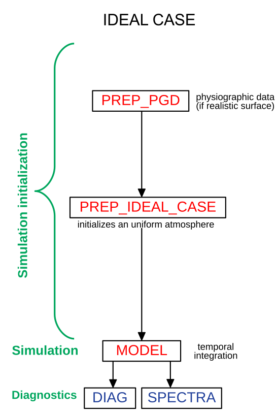

.. _ideal_cases:

Ideal cases
================================================

The general workflow for ideal case simulation is :

* initialize of the surface fields : idealised (:ref:`prep_ideal_case`) or realistic (:ref:`prep_pgd`)

* specify an uniform atmosphere from a profile (:ref:`prep_ideal_case`)

* add a perturbation (:ref:`prep_ideal_case`)

* launch the simulation (:ref:`mesonh`)

* compute diagnostics (:ref:`diag` and :ref:`spectra`)

This workflow is describe in the following figure : 

   
   General algorithm for ideal case's simulation.

Some basic example are describe hereafter : 

.. toctree::
   :maxdepth: 1

   ideal_cases_step_by_step/1D/1D.rst
   ideal_cases_step_by_step/2D/2D.rst
   ideal_cases_step_by_step/3D/3D.rst
   ideal_cases_step_by_step/3D_withPGD/3D_withPGD.rst
   ideal_cases_step_by_step/grid_nesting/grid_nesting.rst
   
.. note::

   If you need advance settings, please go to :ref:`cases_catalogue` section.
