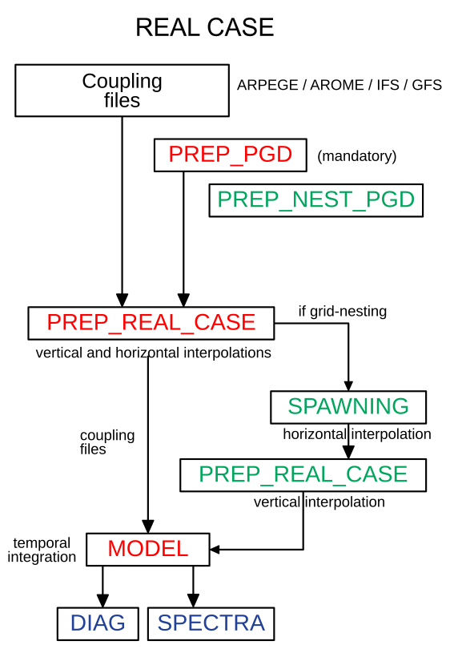

Real cases step-by-step
================================================

   General algorithm for real case's simulation with no nesting and grid-nesting.

1 domaine
grid-nesting (2 or more domain)
2 coupled independent one-domain (change vertical grid)

