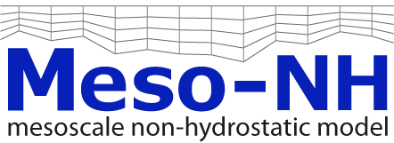

|

Meso-NH's website
=============================

.. note::

   This website is under development.

.. toctree::
   :maxdepth: 2
   :caption: Getting started

   getting_started/why_using_mesonh.rst
   getting_started/download.rst
   getting_started/installation_compilation.rst
   getting_started/get_atmospheric_data.rst
   getting_started/get_surface_data.rst
   getting_started/ideal_case_step_by_step.rst
   getting_started/real_case_step_by_step.rst
   
.. toctree::
   :maxdepth: 2
   :caption: Documentation

   documentation/user_guides.rst
   documentation/scientific_documentation.rst
   documentation/graphics.rst
   documentation/training_material.rst
   documentation/faq.rst

.. toctree::
   :maxdepth: 2
   :caption: Examples

   examples/test_cases.rst
   examples/gallery.rst

.. toctree::
   :maxdepth: 2
   :caption: Community

   community/meetings.rst
   Publications (JPC) <http://mesonh.aero.obs-mip.fr/cgi-bin/mesonh/publi.pl?art=on&phd=on>
   community/newsletters/newsletters.rst

.. toctree::
   :maxdepth: 2
   :caption: Sphinx examples

   sphinx_examples/examples.rst
